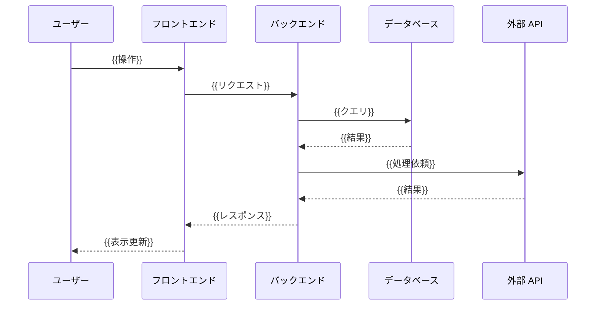
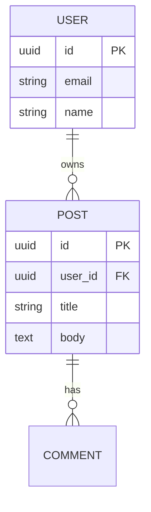
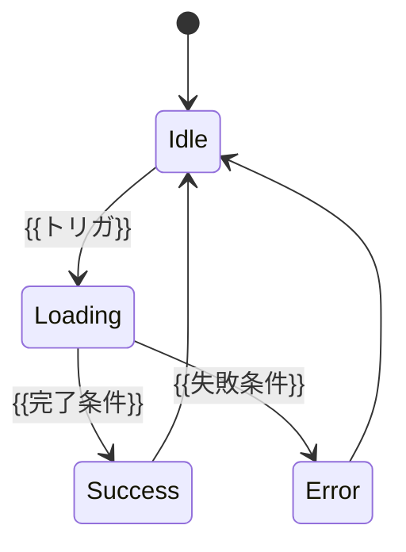

# 機能設計書

## システム構成図

{{Mermaid 図でフロントエンド・バックエンド・DB・外部 API の関係を示す。
ASCII アート版は併記してもよい（テキストエディタでの可視性確保）。}}

```mermaid
graph LR
    U[ユーザーブラウザ] -->|HTTPS| F[{{フロントエンド}}]
    F -->|REST/GraphQL/WS| B[{{バックエンド API}}]
    B --> D[({{データベース}})]
    B --> EXT1[{{外部 API 1}}]
    B --> EXT2[{{外部 API 2}}]
```

```
+--------+    HTTPS    +----------------+    {{プロトコル}}    +----------------+
| Browser| ==========> | {{Frontend}}   | ==================> | {{Backend API}}|
+--------+             +----------------+                     +----------------+
                                                                   |    |
                                                          {{DB / 外部 API}}
```

---

## データフロー

### {{主要パイプライン名（例: ログインフロー / 検索クエリ / リアルタイム通知）}}

{{各処理の入力・出力・順序をシーケンス図で記述。
非同期処理・ストリーミングがある場合は明示する。}}



**動作の核**:
- {{他のシステムにない非自明な挙動 1}}
- {{他のシステムにない非自明な挙動 2}}
- 計測: {{主要 KPI と実測値}}

---

## コンポーネント設計

### フロントエンド層

| コンポーネント | ファイル | 責務 |
|-------------|---------|------|
| {{コンポーネント名}} | `{{path/to/file}}` | {{役割}} |

### バックエンド層

| コンポーネント | ファイル | 責務 |
|-------------|---------|------|
| {{コンポーネント名}} | `{{path/to/file}}` | {{役割}} |

### データ層

| エンティティ | テーブル / コレクション | 責務 |
|-------------|----------------------|------|
| {{エンティティ名}} | `{{table_name}}` | {{役割}} |

---

## 通信プロトコル設計

### API エンドポイント一覧

| メソッド | パス | リクエスト | レスポンス | 用途 | 認証 |
|---------|------|----------|-----------|------|------|
| {{HTTP/WS}} | `{{/api/path}}` | {{リクエスト形式}} | {{レスポンス形式}} | {{用途}} | {{要否}} |

### {{プロトコル詳細（必要に応じて）}}

{{WebSocket メッセージスキーマ / GraphQL スキーマ / イベント形式等を記述}}

| type | 方向 | フォーマット | 用途 |
|------|------|-----------|------|
| `{{name}}` | {{方向}} | JSON / Binary | {{用途}} |

### 上限・タイムアウト

| 項目 | 値 | 環境変数 |
|------|----|-----|
| {{上限項目}} | {{値}} | `{{ENV_VAR}}` |

---

## データモデル

### ER 図



### 主要テーブル定義

| カラム | 型 | 制約 | 説明 |
|-------|----|----|------|
| `{{column}}` | {{type}} | {{NOT NULL / UNIQUE 等}} | {{説明}} |

---

## {{機能別詳細セクション（必要に応じて追加）}}

### {{認証フロー / 検索ロジック / 通知配信 など、機能固有の設計}}

{{機能固有の挙動・パラメータ・状態遷移を記述。
状態遷移は Mermaid `stateDiagram-v2` で表現する。}}



---

## 既存機能との互換性・影響範囲

| 機能 | 影響 | 緩和策 |
|------|------|------|
| {{既存機能}} | {{影響度}} | {{緩和策}} |

---

## 非機能要件への対応

| 要件カテゴリ | 設計上の対応 |
|------------|-------------|
| パフォーマンス | {{キャッシュ戦略 / DB インデックス / CDN 等}} |
| 信頼性 | {{リトライ / サーキットブレーカー / フォールバック}} |
| セキュリティ | {{入力バリデーション / CSRF / XSS 対策 / レート制限}} |
| 可観測性 | {{ログ / メトリクス / トレース}} |