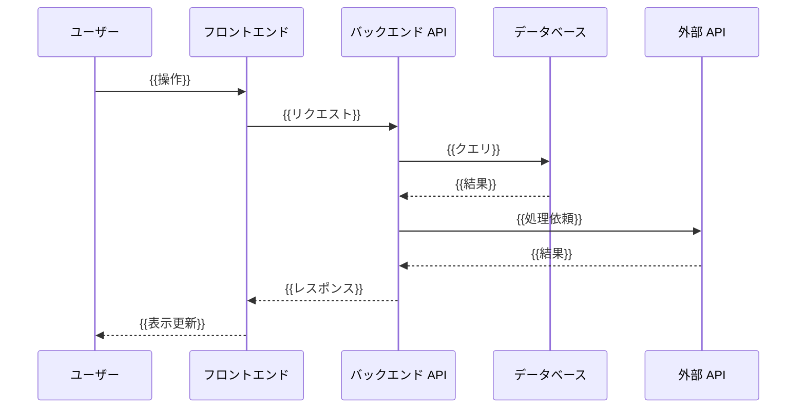
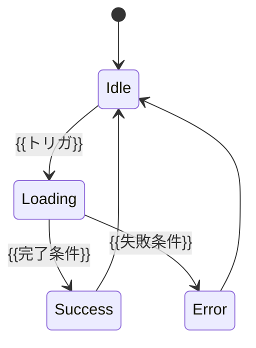

# 設計書: {{開発タイトル}}

| 項目 | 内容 |
|------|------|
| 作成日 | {{YYYY-MM-DD}} |
| 担当 | バルベルデ（architecture-designer） |
| 関連要求 | `.steering/{{YYYYMMDD-開発タイトル}}/requirements.md` |

---

## 1. 概要

### 設計方針サマリ

- **目的**: {{requirements.md のゴールを 1〜2 行で再掲（数値目標を含めて）}}
- **方式**: {{採用する技術アプローチを 1〜3 行で}}
- **最小スコープ厳守**: {{今回やらないこと、後続スプリントに送るものを明示}}
- **既存資産は壊さない**: {{維持する既存機能・ナレッジを列挙}}
- **ハードコーディング禁止**: {{設定値の集約先}}

### スコープ確定

| 項目 | 採用 |
|------|------|
| {{論点 A}} | {{採否＋一言理由（requirements.md Q1 に対応）}} |
| {{論点 B}} | {{採否＋一言理由（requirements.md Q2 に対応）}} |
| {{論点 C}} | {{採否＋一言理由（requirements.md Q3 に対応）}} |

---

## 2. アーキテクチャ図

### 2.1 シーケンス図



### 2.2 全体システム構成（更新版）

```mermaid
graph LR
    U[ユーザーブラウザ] -->|HTTPS| F[{{Frontend}}]
    F -->|REST/GraphQL/WS| B[{{Backend}}]
    B --> D[({{Database}})]
    B --> EXT1[{{外部依存 1}}]
```

---

## 3. コンポーネント設計

### 3.1 バックエンド側 — `{{backend/src/routes/xxx.{ts,py}}}`

{{責務分離・触らない領域を明示。コア層の不変性を保つことが多い。}}

| クラス/関数 | 責務 |
|-------------|------|
| `{{ClassName}}` | {{役割}} |
| `{{methodA()}}` | {{役割}} |
| `{{methodB()}}` | {{役割}} |

**設計上の重要点**

- {{並列化・順序保証・トランザクション境界などの非自明な判断を箇条書きで}}
- {{既存ロジックとの差分のうち、特に注意すべき点}}

### 3.2 フロントエンド側 — `{{frontend/src/xxx.{ts,tsx,vue}}}`

```ts
// {{公開 API / Hook / Component の signature スケッチ}}
export interface {{ResultType}} {
  ok: boolean;
  // ...
}

export function {{publicApiName}}(/* ... */): {{ResultType}} {
  // ...
}
```

**設計上の重要点**

- {{同期/非同期、状態管理、エラー境界の扱い}}
- {{採用ライブラリの選定理由}}
- {{パフォーマンス（メモ化・遅延ロード・サスペンス）への配慮}}

### 3.3 既存処理の改造ポイント

| 既存処理 | 変更 |
|---------|------|
| {{既存の関数・ロジック}} | {{差し替え内容}} |
| {{既存のコンポーネント}} | {{差し替え内容}} |
| {{コア処理}} | **変更なし**（既知ナレッジ厳守） |

---

## 4. {{プロトコル / データ構造 設計（必要に応じて）}}

### 4.1 {{API エンドポイント / メッセージ種別}}

| メソッド | パス | リクエスト | レスポンス | 用途 | 認証 |
|---------|------|----------|-----------|------|------|
| {{HTTP/WS}} | `{{/api/path}}` | {{形式}} | {{形式}} | {{用途}} | {{要否}} |

### 4.2 {{バリデーション / フォーマット規約}}

- {{Zod / Pydantic / JSON Schema 等によるバリデーション}}
- {{日付フォーマット（ISO 8601）/ 数値の精度 / NULL の扱い}}

### 4.3 ペイロード上限

| 項目 | 値 | 環境変数 |
|------|----|-----|
| {{上限項目 1}} | {{値}} | `{{ENV_VAR_NAME}}` |
| {{上限項目 2}} | {{値}} | `{{ENV_VAR_NAME}}` |

---

## 5. 状態遷移（必要なら）



---

## 6. エラーハンドリング

| シナリオ | バックエンド側挙動 | フロントエンド側挙動 |
|---------|-------------------|---------------------|
| {{失敗ケース 1}} | {{送信内容・ログ}} | {{表示・復帰挙動}} |
| {{失敗ケース 2}} | {{送信内容・ログ}} | {{表示・復帰挙動}} |
| ネット切断 | {{セッションクリーンアップ}} | {{タイムアウト後のリトライ / オフライン表示}} |

**タイムアウト値（環境変数化）**

| 値 | デフォルト | 変数 |
|----|-----------|------|
| {{項目 1}} | {{値}} | `{{ENV_VAR}}` |

---

## 7. データモデル / DB 設計（必要に応じて）

### 7.1 設計の核

- {{エンティティ間の関係・トランザクション境界}}
- {{インデックス戦略・正規化レベル}}

### 7.2 マイグレーション

| マイグレーション | 内容 | 影響範囲 |
|----------------|------|---------|
| `{{YYYYMMDDHHMMSS}}_xxx` | {{追加・変更内容}} | {{影響テーブル}} |

### 7.3 ハードコーディング集約

| 環境変数 / 定数 | 用途 | 既定値 |
|----------------|------|-------|
| `{{ENV_VAR_NAME}}` | {{用途}} | {{値}} |

---

## 8. 影響範囲

### 8.1 変更/新規ファイル

| ファイル | 種別 | 内容 |
|---------|------|------|
| `{{path/to/file}}` | 新規/変更/削除 | {{内容}} |

### 8.2 既存機能への影響

| 機能 | 影響 | 緩和策 |
|------|------|------|
| {{既存機能 1}} | {{なし / 軽微 / 重大}} | {{緩和策}} |

---

## 9. PoC スコープと成功基準

### 9.1 検証項目（受け入れ条件への対応）

| 受け入れ条件 | 検証方法 |
|-------------|---------|
| {{requirements.md §7 の各項目}} | {{具体的な確認手順 / コマンド}} |

### 9.2 計測指標

| 指標 | 目標 | 計測点 |
|------|------|-------|
| {{指標 1}} | {{値}} | {{計測点}} |

**理論値**: {{各処理時間の積み上げ計算と目標達成の根拠}}

### 9.3 失敗時のフォールバック

- {{目標未達時の代替案 / 別スプリントへの送り}}
- {{採用ライブラリが不安定な場合の代替}}

---

## 10. 未確定事項・要シャビ判断

### 10.1 Q1〜QN の判断（バルベルデ推奨）

#### Q1: {{論点名}}

| 案 | トレードオフ | 推奨 |
|----|--------------|------|
| **A. {{案 A}}** | {{利点 / 欠点}} | {{採否}} |
| B. {{案 B}} | {{利点 / 欠点}} | {{採否}} |

**推奨理由**: {{なぜこの案を選ぶか、既知ナレッジとの整合性も含めて}}

### 10.2 残る未確定事項（実装中にシャビ判断が必要になる可能性）

| # | 項目 | 内容 |
|---|------|------|
| Q{{N}} | {{項目}} | {{トリガ・判断材料}} |

---

## 設計品質チェック

- {{セキュリティ: 入力上限 / 認証 / CSRF / CORS / Origin 検証 等}}
- {{テスタビリティ: 分割した責務、単独テスト可能性}}
- {{モジュール性: 既存 core 不変、routes/サービス層のみ差替}}
- {{コスト効率: 追加依存の最小化、外部 API コール数の見積もり}}
- {{保守性: 拡張性、後方互換性}}
- {{可観測性: ログ・メトリクス・トレースの埋め込み}}

---

作成: バルベルデ / {{YYYY-MM-DD}}