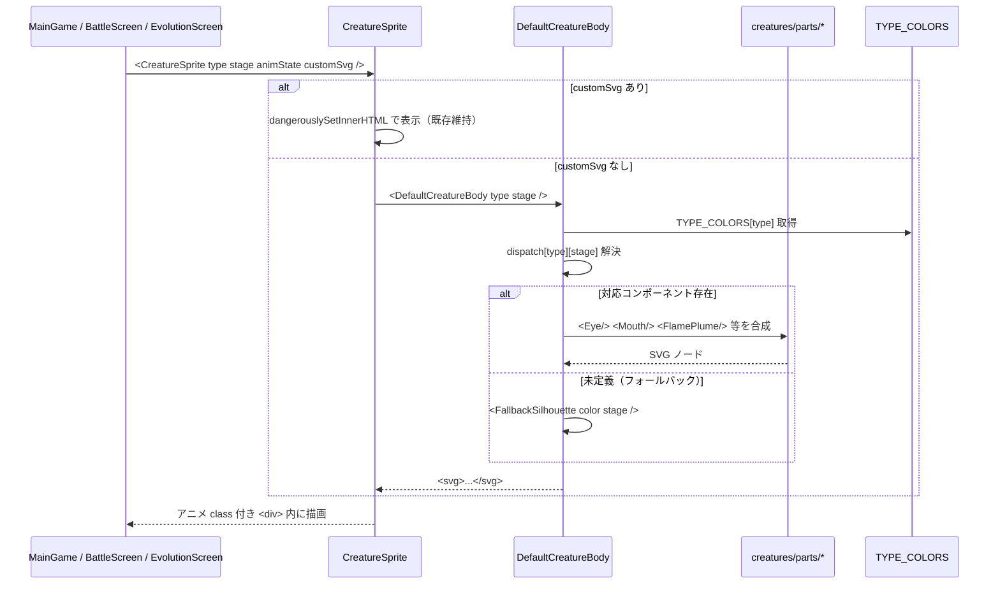
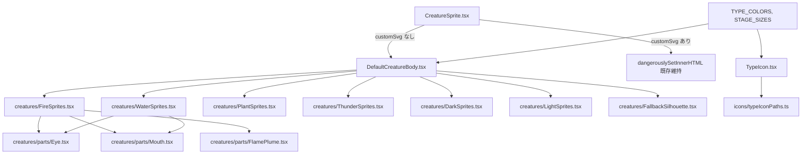

# 設計書: 標準クリーチャーグラフィックの SVG 化（絵文字排除）

| 項目 | 内容 |
|------|------|
| 作成日 | 2026-05-03 |
| 担当 | バルベルデ（architecture-designer） |
| 関連要求 | `.steering/20260503-creature-graphics-redesign/requirements.md` |

---

## 1. 概要

### 設計方針サマリ

- **目的**: クリーチャー本体の絵文字依存を 0% にし、6 タイプ × 5 ステージ = 30 体の標準 SVG で「育てた感」をシルエット継承で演出する。バンドル増は gzip +30KB 以内、バトル 60fps 維持。
- **方式**: 既存 `PixelBody` を `<DefaultCreatureBody type stage animState />` ディスパッチコンポーネントに置換。タイプ別 1 ファイル（`FireSprites.tsx` など 6 ファイル）に `Stage1〜Stage5` の純粋 React/JSX SVG コンポーネントを定義。共通幾何パーツ（目・口・足・オーラ）は `creatures/parts/` で再利用、色は `TYPE_COLORS` 一元管理。
- **最小スコープ厳守**: 状態演出絵文字（💤✨💧🍖⚠️）・`customSvg` の機能・アニメーション体系・ゲームバランス系定数は今回触らない。Stage 0（卵）の CSS 描画は維持。
- **既存資産は壊さない**: `customSvg` 優先表示の分岐（`CreatureSprite.tsx:226`）、`customSprites` の IndexedDB スキーマ、`BattleScreen` の opponent customSvg フォールバック（直近 fix 済み）、QR ペイロードからの `customSvg` 除外（`creatureCodec.ts`）はそのまま維持。
- **ハードコーディング禁止**: SVG 内の色は **すべて props 経由で `TYPE_COLORS` から流す**。色値リテラル（`#ff6b35` など）を子 SVG 内に書かない。サイズスケールも `STAGE_SIZES` 定数を新設して集約。

### スコープ確定

| 項目 | 採用 |
|------|------|
| Q1. ファイル分割粒度 | **タイプ別 1 ファイル**（`creatures/FireSprites.tsx` など 6 本）。Tree-shaking より dispatcher の見通しと共同編集体験を優先 |
| Q2. シルエット継承の実装パターン | **共通パーツ抽出 + コンポジション**（`<Eye>` `<FlamePlume>` `<RootBase>` 等）。各タイプの「特徴パーツ」を Stage 1→5 で大型化・追加することで形を継承 |
| Q3. 画風方針 | **① 太線アウトライン＋単色塗り（cel-shading 風）を第一候補**。Phase A プロトタイプで実物確認 → シャビ承認ゲートで確定 |
| Q4. クリーチャー SVG とタイプアイコンの画風統一 | **共通「見た目言語」を §3.4 で定義**（線幅・カラーパレット・viewBox 比率・余白）。`TypeIcon` も同言語で実装 |
| Q5. Stage 0（卵）の扱い | **現状 CSS 描画を維持**。卵にはタイプカラーの差別化が既にあり、SVG 化のバンドル増が割に合わない |

---

## 2. アーキテクチャ図

### 2.1 描画ディスパッチのシーケンス



### 2.2 コンポーネント構成（更新版）



---

## 3. コンポーネント設計

### 3.1 ディスパッチャ — `frontend/src/components/creatures/DefaultCreatureBody.tsx`（新規）

```tsx
import type { CreatureType, EvolutionStage } from '../../types/creature'
import { TYPE_COLORS } from '../../data/evolutions'
import { STAGE_SIZES } from '../../data/spriteConfig'
import { FireSprites } from './FireSprites'
// ... 他タイプ
import { FallbackSilhouette } from './FallbackSilhouette'

export interface DefaultCreatureBodyProps {
  type: CreatureType
  stage: EvolutionStage          // 0-5（0 は EggBody が担当するため呼ばれない）
  // animState は CreatureSprite 側の外側ラッパが扱う（責務分離）
}

type StageSpriteMap = Partial<Record<Exclude<EvolutionStage, 0>, React.FC<{ color: string; size: number }>>>

const SPRITE_DISPATCH: Record<CreatureType, StageSpriteMap> = {
  Fire:    FireSprites,
  Water:   WaterSprites,
  Plant:   PlantSprites,
  Thunder: ThunderSprites,
  Dark:    DarkSprites,
  Light:   LightSprites,
}

export function DefaultCreatureBody({ type, stage }: DefaultCreatureBodyProps) {
  const color = TYPE_COLORS[type]
  const size = STAGE_SIZES[stage]
  if (stage === 0) return null  // 卵は EggBody（既存 CSS）が描画
  const SpriteComp = SPRITE_DISPATCH[type]?.[stage]
  if (!SpriteComp) return <FallbackSilhouette color={color} size={size} stage={stage} />
  return <SpriteComp color={color} size={size} />
}
```

| 関数/コンポーネント | 責務 |
|---|---|
| `DefaultCreatureBody` | type×stage の解決とフォールバック分岐のみ。アニメ・customSvg は扱わない |
| `SPRITE_DISPATCH` | type→stage→React.FC のマッピング表。タイプ別ファイルから集約 |
| `FallbackSilhouette` | 単純な `<ellipse>` シルエット + タイプカラー塗り。クラッシュ防止の保険 |

**設計上の重要点**

- アニメーション（`animate-happy-jump` 等）は `CreatureSprite` 側の **外側 div の className** で従来通り適用。SVG 内部に CSS animation を持ち込まない（責務分離・既存アニメ流用）。
- ステージ別サイズは `STAGE_SIZES = [60,80,100,120,140,160]`（既存値）を `data/spriteConfig.ts` に切り出して両者で共有。
- TypeScript の `Exclude<EvolutionStage, 0>` で Stage 0 を型レベルで排除し、Egg と SVG の責務を分離。

### 3.2 タイプ別 SVG ファイル — `frontend/src/components/creatures/FireSprites.tsx`（新規、他 5 タイプも同形）

```tsx
import type { FC } from 'react'
import { Eye } from './parts/Eye'
import { Mouth } from './parts/Mouth'
import { FlamePlume } from './parts/FlamePlume'

interface SpriteProps { color: string; size: number }

const FireBaby: FC<SpriteProps> = ({ color, size }) => (
  <svg viewBox="0 0 100 100" width={size} height={size} aria-hidden>
    {/* body */}
    <ellipse cx="50" cy="60" rx="32" ry="28" fill={color} stroke="#1a1a1a" strokeWidth="3" />
    <FlamePlume x={50} y={20} scale={0.5} color={color} />
    <Eye x={40} y={55} /> <Eye x={60} y={55} />
    <Mouth x={50} y={70} variant="smile" />
  </svg>
)
const FireChild: FC<SpriteProps>     = (/* ... */) => /* ... */ null as any
const FireAdult: FC<SpriteProps>     = (/* ... */) => /* ... */ null as any
const FirePerfect: FC<SpriteProps>   = (/* ... */) => /* ... */ null as any
const FireUltimate: FC<SpriteProps>  = (/* ... */) => /* ... */ null as any

export const FireSprites = {
  1: FireBaby,
  2: FireChild,
  3: FireAdult,
  4: FirePerfect,
  5: FireUltimate,
} as const
```

**設計上の重要点**

- **viewBox は全タイプ・全ステージで `0 0 100 100` に統一**（座標系の暗算可能性を担保。`width/height` で実サイズ制御）。
- **色値リテラル禁止**。`fill` `stroke` には `color` props か共通定数（黒線 `#1a1a1a` 1 種のみ許容）のみを使う。共通定数は `data/spriteConfig.ts` に集約。
- **シルエット継承**: 例えば Fire は「頭頂の炎飾り（FlamePlume）」を Stage 1 では小、Stage 3 で頭部に固定、Stage 5 で全身を覆う羽根状に拡張、と FlamePlume の `scale` と `variant` で連続性を表現。
- ノード数 30 以下を目安（要求書 §5.1）。グラデーション・filter は使わず単色塗り＋アウトラインに限定（バンドル削減・60fps 担保）。

### 3.3 共通パーツ — `frontend/src/components/creatures/parts/*.tsx`（新規）

| パーツ | 責務 | 使用タイプ |
|---|---|---|
| `Eye` | 黒目 + ハイライト。`variant: 'normal' \| 'angry' \| 'closed'` | 全タイプ |
| `Mouth` | 口形状。`variant: 'smile' \| 'fang' \| 'small'` | 全タイプ |
| `FlamePlume` | 炎飾り。Fire のシルエット継承の核 | Fire（Thunder で再利用検討） |
| `WaterFin` | ヒレ。Water のシルエット継承の核 | Water |
| `Leaf` | 葉飾り。Plant のシルエット継承の核 | Plant |
| `Bolt` | 稲妻形。Thunder のシルエット継承の核 | Thunder |
| `ShadowVeil` | 闇のオーラ。Dark のシルエット継承の核 | Dark |
| `Halo` | 光輪。Light のシルエット継承の核 | Light |

**設計上の重要点**

- パーツは props（`x`, `y`, `scale`, `variant`, `color`）のみ受け取る純粋関数。グローバル状態を持たない。
- 「特徴パーツの大型化＋追加」がシルエット継承のメカニズム。例: `Leaf` は Stage 1 で頭頂 1 枚 → Stage 3 で背中に 3 枚 → Stage 5 で全身に複数群生。
- 共通パーツ抽出により 30 体分の SVG コードが圧縮され、gzip 後 +30KB 目標達成に寄与（推定: 各 SVG 1.5KB × 30 ≒ 45KB から、共通化で 25KB 程度に削減見込み）。

### 3.4 タイプアイコン — `frontend/src/components/TypeIcon.tsx`（新規）

```tsx
import type { CreatureType } from '../types/creature'
import { TYPE_COLORS } from '../data/evolutions'
import { TYPE_ICON_PATHS } from '../data/typeIconPaths'

export interface TypeIconProps {
  type: CreatureType
  size?: number   // px
  withBg?: boolean
}

export function TypeIcon({ type, size = 24, withBg = false }: TypeIconProps) {
  const color = TYPE_COLORS[type]
  return (
    <svg viewBox="0 0 24 24" width={size} height={size} aria-label={`${type} type`}>
      {withBg && <circle cx="12" cy="12" r="11" fill={color} opacity="0.15" />}
      <path d={TYPE_ICON_PATHS[type]} fill={color} stroke="#1a1a1a" strokeWidth="1.2" />
    </svg>
  )
}
```

**設計上の重要点（共通「見た目言語」= Q4 の結論）**

- **viewBox**: タイプアイコンは `0 0 24 24`、クリーチャー本体は `0 0 100 100`（縮尺は違うが線比率を揃える）。
- **線幅比**: クリーチャー `strokeWidth=3` / viewBox 100 = 3%。タイプアイコン `strokeWidth=1.2` / viewBox 24 = 5%（小サイズで視認性確保）。
- **カラーパレット**: `TYPE_COLORS`（既存）+ アウトライン `#1a1a1a` のみ。グラデ・半透明白ハイライトは禁止（画風統一）。
- **デフォルメ度**: 「丸み主体・角は最小」。武器類は持たせない。
- アイコンモチーフ: Fire=炎, Water=しずく, Plant=葉, Thunder=稲妻, Dark=三日月, Light=星。`typeIconPaths.ts` に path d 文字列を集約。

### 3.5 既存処理の改造ポイント

| 既存処理 | 変更 |
|---|---|
| `CreatureSprite.tsx` の `PixelBody` 関数（L24-163） | **削除し**、`<DefaultCreatureBody type stage />` 呼び出しに置換。Stage 0 のみ `<EggBody color size />` として既存 CSS を関数切り出し |
| `CreatureSprite.tsx` の `SPRITE_EMOJIS` 定数（L14-21） | **削除** |
| `CreatureSprite.tsx` の `customSvg` 分岐（L226-234） | **変更なし**（信頼境界内 `dangerouslySetInnerHTML` を維持。E-4 ナレッジ厳守） |
| `CreatureSprite.tsx` の状態演出絵文字（💤✨💧🍖⚠️、L188-222） | **変更なし**（スコープ外） |
| `CreatureSprite.tsx` の `getAnimClass()` / shadow（L168-181, 238-245） | **変更なし**（責務分離・既存アニメ流用） |
| `evolutions.ts` の `TYPE_EMOJIS` | **削除** または非推奨化（後方互換のため最終 PR で削除） |
| `CreatureSetup.tsx` L108, L138（`TYPE_EMOJIS[type]`） | `<TypeIcon type size={28} />` に置換 |
| `EvolutionScreen.tsx` L55（前進化名の前に絵文字） | `<TypeIcon type size={20} />` に置換 |
| `MainGame.tsx` L63（タイプ表示） | `<TypeIcon type size={18} />` に置換 |
| `StatusScreen.tsx` L75, L85, L193 | `<TypeIcon type size={...} />` に置換。L193 の死亡時 `🪦` は記号として機能しているため**残す**（スコープ外）|
| `BattleScreen.tsx` `BattleCreatureDisplay.tsx` の `customSvg` 経路 | **変更なし**（直近 fix 済みロジック維持） |
| `useBattleWebSocket.ts` `creatureCodec.ts` `storage.ts` | **変更なし**（customSprites のシリアライズ・QR 除外・サイズ検証は維持） |

---

## 4. データ構造設計

### 4.1 新規定数ファイル — `frontend/src/data/spriteConfig.ts`（新規）

```ts
import type { EvolutionStage } from '../types/creature'

// クリーチャー本体ステージ別実描画サイズ（px）。既存 CreatureSprite 内のローカル値を集約
export const STAGE_SIZES: Record<EvolutionStage, number> = {
  0: 60, 1: 80, 2: 100, 3: 120, 4: 140, 5: 160,
}

// シャドウ幅（既存値の集約）
export const SHADOW_WIDTHS: Record<EvolutionStage, number> = {
  0: 40, 1: 55, 2: 70, 3: 85, 4: 100, 5: 115,
}

// 全 SVG 共通の黒線色（パレット限定）
export const SVG_OUTLINE_COLOR = '#1a1a1a'
```

### 4.2 アイコン path 定義 — `frontend/src/data/typeIconPaths.ts`（新規）

```ts
import type { CreatureType } from '../types/creature'

// viewBox 0 0 24 24 前提。各 path は中心 (12,12) を意識した形状
export const TYPE_ICON_PATHS: Record<CreatureType, string> = {
  Fire:    'M12 2 ...',  // 炎
  Water:   'M12 3 ...',  // しずく
  Plant:   'M12 4 ...',  // 葉
  Thunder: 'M13 2 ...',  // 稲妻
  Dark:    'M16 4 ...',  // 三日月
  Light:   'M12 2 ...',  // 星
}
```

### 4.3 ペイロード上限 / 制約

| 項目 | 値 | 場所 |
|---|---|---|
| クリーチャー SVG ノード数（目安） | 30 以下 | レビュー基準 |
| バンドル増（gzip） | +30KB 以内 | `npm run build` 計測 |
| `customSprites` 個別 SVG サイズ | 500KB | `storage.ts:243` 既存検証（変更なし） |

---

## 5. 状態遷移

本スプリントでは新規ステートマシンを導入しない。`animState` のライフサイクルは既存通り `CreatureSprite` のラッパが `className` 切替で表現する。SVG 子コンポーネントは `animState` を **受け取らない**（責務分離）。

---

## 6. エラーハンドリング

| シナリオ | 挙動 |
|---|---|
| `SPRITE_DISPATCH[type][stage]` が未定義 | `<FallbackSilhouette>` で単純シルエット表示。コンソールに `console.warn`（dev のみ）。クラッシュ禁止 |
| `TYPE_COLORS[type]` 不在（型エラー回避用） | TypeScript の型で防御。実行時は `?? '#888'` でフォールバック |
| `customSvg` が不正 SVG 文字列 | 既存 `storage.ts` の検証経路に依存（変更なし）。本スプリントでは触らない |
| Service Worker 旧キャッシュで古い SVG が出る | dev/staging で SW unregister 手順を `decisions.md` に明記。本番は SW のキャッシュキー更新（既存ナレッジ A-7） |

---

## 7. データモデル / DB 設計

**変更なし**。`Creature.customSprites` のスキーマ（`Partial<Record<EvolutionStage, string>>`）は維持。IndexedDB マイグレーション不要。セーブデータ互換性 100%。

---

## 8. 影響範囲

### 8.1 変更/新規ファイル

| ファイル | 種別 | 内容 |
|---------|------|------|
| `frontend/src/components/CreatureSprite.tsx` | 変更 | `PixelBody` 削除 → `DefaultCreatureBody` 呼び出しへ置換。`SPRITE_EMOJIS` 削除。Stage 0 は `<EggBody>` に切り出し |
| `frontend/src/components/creatures/DefaultCreatureBody.tsx` | 新規 | type×stage ディスパッチ |
| `frontend/src/components/creatures/EggBody.tsx` | 新規 | Stage 0 の CSS 描画切り出し |
| `frontend/src/components/creatures/FireSprites.tsx` | 新規 | Fire Stage1-5（Phase A） |
| `frontend/src/components/creatures/WaterSprites.tsx` | 新規 | Water Stage1-5（Phase B） |
| `frontend/src/components/creatures/PlantSprites.tsx` | 新規 | Plant Stage1-5（Phase B） |
| `frontend/src/components/creatures/ThunderSprites.tsx` | 新規 | Thunder Stage1-5（Phase B） |
| `frontend/src/components/creatures/DarkSprites.tsx` | 新規 | Dark Stage1-5（Phase B） |
| `frontend/src/components/creatures/LightSprites.tsx` | 新規 | Light Stage1-5（Phase B） |
| `frontend/src/components/creatures/FallbackSilhouette.tsx` | 新規 | フォールバック単純シルエット |
| `frontend/src/components/creatures/parts/Eye.tsx` | 新規 | 共通目パーツ |
| `frontend/src/components/creatures/parts/Mouth.tsx` | 新規 | 共通口パーツ |
| `frontend/src/components/creatures/parts/FlamePlume.tsx` | 新規 | Fire 特徴パーツ |
| `frontend/src/components/creatures/parts/WaterFin.tsx` | 新規 | Water 特徴パーツ |
| `frontend/src/components/creatures/parts/Leaf.tsx` | 新規 | Plant 特徴パーツ |
| `frontend/src/components/creatures/parts/Bolt.tsx` | 新規 | Thunder 特徴パーツ |
| `frontend/src/components/creatures/parts/ShadowVeil.tsx` | 新規 | Dark 特徴パーツ |
| `frontend/src/components/creatures/parts/Halo.tsx` | 新規 | Light 特徴パーツ |
| `frontend/src/components/TypeIcon.tsx` | 新規 | タイプアイコン SVG |
| `frontend/src/data/spriteConfig.ts` | 新規 | サイズ・線色定数集約 |
| `frontend/src/data/typeIconPaths.ts` | 新規 | タイプアイコン path 集約 |
| `frontend/src/data/evolutions.ts` | 変更 | `TYPE_EMOJIS` 削除（最終 PR） |
| `frontend/src/components/CreatureSetup.tsx` | 変更 | L108, L138 を `<TypeIcon>` に置換 |
| `frontend/src/components/EvolutionScreen.tsx` | 変更 | L55 を `<TypeIcon>` に置換 |
| `frontend/src/components/MainGame.tsx` | 変更 | L63 を `<TypeIcon>` に置換 |
| `frontend/src/components/StatusScreen.tsx` | 変更 | L75, L85, L193（死亡時 `🪦` 以外）を `<TypeIcon>` に置換 |

### 8.2 既存機能への影響

| 機能 | 影響 | 緩和策 |
|---|---|---|
| `customSvg` 優先表示 | **なし**（分岐ロジック維持） | 受け入れテストで Phase A 完了時に確認 |
| バトル中の opponent 描画 | **なし**（`customSvg` フォールバック維持） | `BattleScreen.tsx:414` を読み込み確認済み |
| QR エクスポート/インポート | **なし**（`creatureCodec.ts` の customSvg 除外維持） | 変更ファイルに含めない |
| IndexedDB セーブデータ | **なし** | スキーマ変更なし |
| アニメーション（9 種） | 軽微 | SVG 外側の div に従来通り className 適用。Phase A で全 animState を目視確認 |
| PWA Service Worker | 軽微 | キャッシュキー更新タイミングで旧 SVG が残る可能性。ナレッジ A-7 に従い dev で SW unregister 手順を decisions.md に記載 |
| 死亡時 `🪦`（StatusScreen L193） | **なし**（記号として残す。スコープ外） | 要求書 §3.2 に整合 |

---

## 9. PoC スコープと成功基準

### 9.1 検証項目（受け入れ条件への対応）

| 受け入れ条件（要求書 §7） | 検証方法 |
|---|---|
| `SPRITE_EMOJIS` 削除 | `grep -n SPRITE_EMOJIS frontend/src` で 0 件 |
| Stage 1-5 全 6 タイプの SVG 表示 | dev 起動 + dev mode で全進化を巡回し目視 |
| Stage 2 頭上の絵文字なし | `CreatureSprite.tsx` から該当 JSX 削除確認 |
| `TYPE_EMOJIS` 直接利用なし | `grep -n "TYPE_EMOJIS\[" frontend/src` で `evolutions.ts` 内定義以外 0 件、最終 PR で定義も削除 |
| 全アニメ状態が SVG 上で動作 | 9 状態（idle/happy/sleeping/attack/evolving/dead/sad/hungry/critical）を dev mode で順次トリガし目視 |
| 既存セーブデータ互換 | 既存 IndexedDB の Creature をロードし全 type×stage を巡回 |
| `customSvg` 個体の優先表示 | drawing で SVG 描画した個体を表示し標準 SVG にフォールバックしないこと確認 |
| バンドル +30KB 以内 | Phase A 後・Phase B 後で `npm run build` の gzip サイズを before/after 比較 |
| 60fps 維持 | DevTools Performance でバトル 30 秒録画、フレーム落ち無きこと確認 |
| ナレッジ A-7 / E-4 違反なし | コードレビュー時 + クルトワレビュー |
| クルトワ Critical/High なし | Phase C で security-review skill 実行 |

### 9.2 計測指標

| 指標 | 目標 | 計測点 |
|---|---|---|
| バンドル増（gzip） | +30KB 以内 | `npm run build` 出力 |
| クリーチャー SVG 1 体あたりノード数 | 30 以下 | コードレビュー目視 |
| バトル平均 FPS | 60fps | DevTools Performance |
| LCP | 2.5s 以下 | Lighthouse（既存目標） |

**理論値（バンドルサイズ積算）**: クリーチャー SVG 30 体 × 平均 1.5KB（共通パーツ抽出後）= 45KB、gzip 圧縮率 60%（JSX 内 path/数値の繰り返しで圧縮効きやすい）≒ **+18KB**。タイプアイコン 6 種 × 0.5KB = 3KB、gzip 後 ≒ **+1.5KB**。合計 **約 +20KB**（目標 +30KB に対し 10KB 余裕）。

### 9.3 失敗時のフォールバック

- **バンドル超過時**: 共通パーツ化を強化、または ノード数削減（ディテール簡略化）。それでも超過するなら `lazy import` でタイプ別ファイルを動的ロード（初期表示は active creature のみ）
- **60fps 未達時**: ノード数削減、`will-change` の見直し、`React.memo` 化を検討
- **画風がシャビ承認を得られない場合**: Phase A プロトタイプの段階で Q3 の他案（②グラデ多用 / ③ピクセル風）に切り替え。Phase B には進まない
- **共通パーツ抽出が逆に複雑化する場合**: 各 SVG 独立記述に切り替え（Q2 の代替案）。decisions.md に記録

---

## 10. 未確定事項・要シャビ判断

### 10.1 Q1〜Q5 の判断（バルベルデ推奨）

#### Q1: ファイル分割粒度

| 案 | トレードオフ | 推奨 |
|----|--------------|------|
| **A. タイプ別 1 ファイル**（`FireSprites.tsx` 等 6 本、Stage1-5 を 1 ファイル内） | ＋ Phase B でタイプごとに並列実装しやすい / シルエット継承を 1 ファイル内で見通せる / dispatcher が綺麗 / 共通 import 1 回で済みコード重複少 — シルエット継承の実装コスト低／ 1 ファイル ~300 行で許容範囲 | **採用** |
| B. type × stage ごと細分化（30 ファイル） | 単体ファイルは小さい / Tree-shaking が効く — ファイル数が多く dispatcher の import が肥大、シルエット継承の見通しが悪い | 不採用 |
| C. 全部 `creatureSvgs.tsx` に集約 | dispatcher 不要 — 1 ファイル 1500 行超になり共同編集衝突しやすい、Phase B 並列困難 | 不採用 |

**推奨理由**: Phase A→B のフロー（モドリッチが Fire 1 タイプ実装 → エンバペが残り 5 タイプ並列実装）に最も適合する。シルエット継承は 1 ファイル内で Stage1→5 を縦に並べるのが最も読みやすい。Tree-shaking 効果は 30 体 ≒ 20KB 程度のため誤差レベル。

#### Q2: シルエット継承の実装パターン

| 案 | トレードオフ | 推奨 |
|----|--------------|------|
| **A. 共通パーツ抽出 + コンポジション**（`<Eye>` `<FlamePlume>` 等） | ＋ シルエット継承が「特徴パーツの大型化＋追加」というメンタルモデルで明確 / バンドル削減（重複削減）/ パーツのバリアント追加で表現拡張容易 — 初期パーツ設計コストあり | **採用** |
| B. 各 SVG 独立記述（コピペベース） | 個別最適しやすい — 30 体分の重複コード、シルエット継承が暗黙、バンドル肥大 | 不採用 |

**推奨理由**: 要求書 §2.1「進化時にシルエットの面影を継承し『この子が大きくなった』と認識できる」というゴールに直結する。共通パーツの `scale` `variant` props で継承を**明示的に**コードに表せる。バンドル目標達成にも寄与。

#### Q3: 画風方針

| 案 | トレードオフ | 推奨 |
|----|--------------|------|
| **A. 太線アウトライン+単色塗り（cel-shading 風）** | ＋ ノード数最小（< 30 達成容易）/ gzip 圧縮効きやすい / アニメ追従性高（filter 不使用）/ 手描き SVG 起こしやすい / タイプアイコンと自然に統一可 — 表現力は他案より控えめ | **第一候補（Phase A プロトタイプで確定）** |
| B. グラデーション多用 | 表現豊か — `linearGradient` `radialGradient` 定義でノード増、SVG サイズ増、SSR/PWA キャッシュで再描画コスト増、60fps リスク | 不採用候補 |
| C. ピクセル風 `<rect>` グリッド | レトロ感あり、既存 PWA 風と親和 — 1 体あたり数十〜100 個の `<rect>`、ノード数 30 制約に違反、バンドル肥大、シルエット継承難 | 不採用 |

**推奨理由**: バンドル +30KB 制約・60fps 制約・タイプアイコンとの画風統一（Q4）すべてを同時に満たすのは A のみ。B/C は受け入れ条件達成リスクが高い。**Phase A の Fire プロトタイプで実物を作りシャビ承認を得たうえで確定**。承認時に微調整余地あり（線幅、彩度、ハイライト 1 点許容など）。

#### Q4: クリーチャー SVG とタイプアイコンの画風統一方法

| 案 | トレードオフ | 推奨 |
|----|--------------|------|
| **A. 共通「見た目言語」を §3.4 で定義し両者で守る** | ＋ UI 全体の統一感 / 将来の拡張で迷わない / レビュー基準が明確 — 設計初期コスト | **採用** |
| B. 個別最適 | 自由度高 — UI が散漫、レビュー基準曖昧 | 不採用 |

**推奨理由**: 要求書 §2.2「副次目的: タイプアイコンも SVG 化し画風統一」に直結。本設計書 §3.4 で **viewBox 比率（クリーチャー 100、アイコン 24）／線幅比 3-5%／カラーパレット（TYPE_COLORS + #1a1a1a のみ）／丸み主体／グラデ禁止** を定義済み。Phase B でも同言語を強制。

#### Q5: Stage 0（卵）の扱い

| 案 | トレードオフ | 推奨 |
|----|--------------|------|
| **A. 現状の CSS 描画を維持（`EggBody` に切り出し）** | ＋ バンドル増ゼロ / 既に 6 タイプ差別化済 / Stage 0 は短時間（即時孵化）でユーザー視覚滞在時間が短い — 整合性は若干劣る | **採用** |
| B. SVG 化 | 整合性 — バンドル +約 3KB / 短時間表示のため費用対効果薄 | 不採用 |

**推奨理由**: Stage 0 は「即時 → Stage 1」（要求書外参照: `EVOLUTION_REQUIREMENTS[0].minAge: 0`）であり、ユーザー滞在時間が極めて短い。SVG 化のバンドルコストは Stage 1-5 への投資に回す方が ROI が高い。`EggBody` コンポーネント切り出しで責務分離は確保。

### 10.2 残る未確定事項（実装中にシャビ判断が必要になる可能性）

| # | 項目 | 内容 |
|---|------|------|
| Q6 | Phase A の実物画風 | A 案（cel-shading）で Fire 系列を起こした後、シャビが「もう少し丸み」「線細め」等の調整を求める可能性 |
| Q7 | 死亡時 `🪦`（StatusScreen L193）の扱い | 今回スコープ外としたが、画風統一観点から SVG 化を希望されたら次スプリントで対応 |
| Q8 | バンドル目標到達時の lazy import 採用判断 | 万一 +30KB 超過時に動的 import を導入するか、ディテール削減で対応するか |

---

## 設計品質チェック

- **セキュリティ**: 標準 SVG は React 純粋 JSX のため XSS 経路なし。`customSvg` の `dangerouslySetInnerHTML` は既存ロジック維持（E-4 ナレッジ厳守、入力は描画キャンバス出力のみで信頼境界内）。`storage.ts` の SVG サイズ検証（500KB）は変更なし。
- **テスタビリティ**: ディスパッチャ・各タイプファイル・共通パーツが純粋関数のため Vitest + React Testing Library で snapshot テストが容易。`FallbackSilhouette` 経路のテスト可能。
- **モジュール性**: `CreatureSprite` のアニメ層と SVG 描画層を完全分離。タイプ追加時は `creatures/<NewType>Sprites.tsx` 追加と `SPRITE_DISPATCH` への 1 行追記のみ。
- **コスト効率**: 追加依存ライブラリゼロ（素の JSX SVG）。バンドル +20KB 想定（目標 +30KB）。CDN 帯域・ビルド時間影響なし。
- **保守性**: 共通パーツ抽出により 30 体の修正コストを大幅削減。色定数・サイズ定数の集約でハードコード排除。Phase A→B の段階的展開でリスク隔離。
- **可観測性**: dev でフォールバック発動時 `console.warn`。バンドルサイズは `npm run build` で計測。FPS は DevTools Performance。本番ログは不要（静的アセット相当）。
- **既存ナレッジ厳守**: A-7（PWA SW キャッシュ）= decisions.md に SW unregister 手順を記載。E-4（customSvg XSS 経路）= 信頼境界内表示・QR エクスポート除外を維持。`dangerouslySetInnerHTML` 禁止 = 標準 SVG は JSX 記述、ユーザー描画のみ既存例外運用。

---

作成: バルベルデ / 2026-05-03
