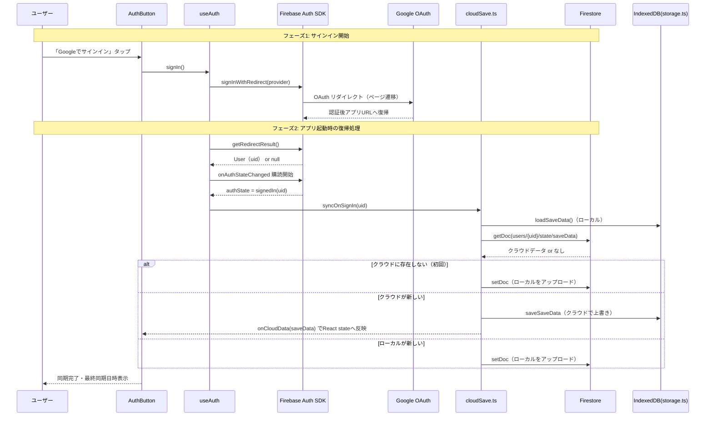
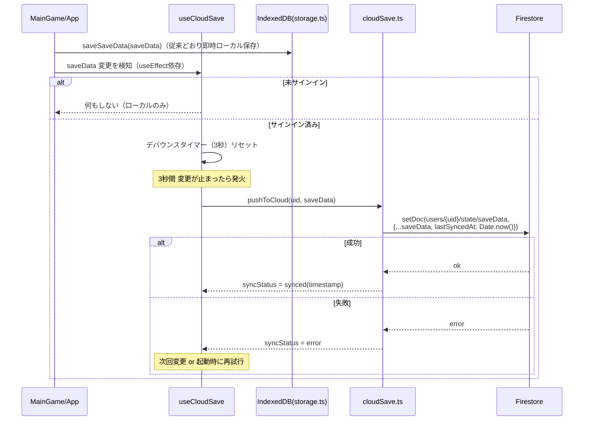
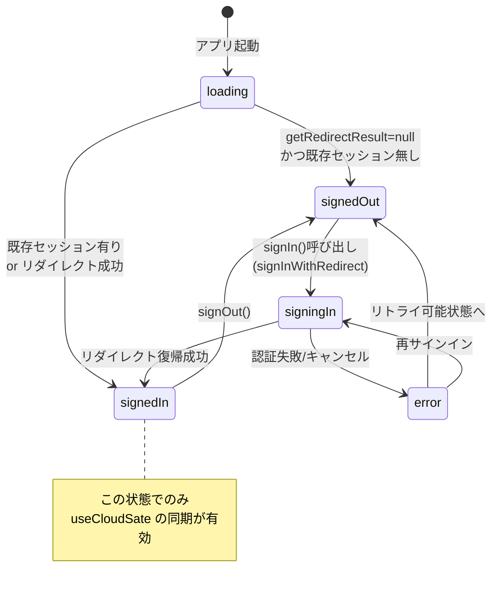

# 設計書: クラウドセーブ × Google アカウント連携

| 項目 | 内容 |
|------|------|
| 作成日 | 2026-06-20 |
| 設計担当 | バルベルデ（architecture-designer） |
| 関連要求書 | `./requirements.md` |
| 対象スプリント | 20260620-cloud-save-google-auth |

---

## 1. 概要

### 1.1 設計方針サマリ

既存の IndexedDB ローカルストレージ（`src/utils/storage.ts`）を**真実の源（source of truth）として温存**し、その上に Firebase Authentication + Cloud Firestore による「クラウド同期レイヤー」を**追加（add-on）**する。ローカルストレージのインターフェース（`saveSaveData` / `loadSaveData`）には手を入れず、同期はフックと独立した service 層で完結させる。これにより、

- **未サインインユーザーの挙動は完全に不変**（IndexedDB 単独で動作）
- サインイン時のみクラウド同期パスが有効化される（feature flag 的なオプトイン）
- Firebase SDK は遅延ロード（dynamic import）でコード分割し、ゲスト利用時はバンドルを引かない

という疎結合な構成を採る。コンフリクト解決は要求書 Q2 確定どおり **`lastSyncedAt` タイムスタンプ比較で新しい方を自動採用**するシンプルなロジックとし、マージ・選択 UI は実装しない（過剰設計の回避）。

### 1.2 スコープ確定（Q1〜Q3 判断結果）

| ID | 論点 | 確定判断 | 設計上の扱い |
|----|------|----------|-------------|
| **Q1** | Firebase Config の供給方法（GitHub Pages CI 統合） | **`.env`（ローカル）+ GitHub Actions Secrets → ビルド時 `env:` 注入** の二重管理 | 本書 §7 で詳細設計 |
| **Q2** | コンフリクト解決 | **タイムスタンプ自動採用（新しい方が勝つ）** | `cloudSave.ts` の `resolveConflict()` に実装。差分しきい値・選択 UI なし |
| **Q3** | OAuth 方式 | **リダイレクト方式** | `signInWithRedirect` + `getRedirectResult`。モバイル PWA でのポップアップブロック回避 |

### 1.3 設計の前提・非目標

- **非目標**: オフライン書き込みキュー、Firestore オフライン永続化、複数セーブスロット、ロールバック（すべて将来スコープ）。
- **前提**: Firebase プロジェクトはシャビが Console で作成済み（Spark 無料プラン）。本設計はコードと CI のみを対象とする。
- バンドルサイズ目標 **+50 KB gzip 以内** を死守するため、Firebase SDK は `firebase/app` `firebase/auth` `firebase/firestore` の **v9 モジュラー形式のみ** import し、Analytics 等は含めない。

---

## 2. アーキテクチャ図

### 2.1 サインインフロー（シーケンス図）

リダイレクト方式のため、フローは「リダイレクト開始」と「リダイレクト復帰時の結果処理」の 2 フェーズに分かれる。



### 2.2 同期フロー（シーケンス図）

ゲームプレイ中のセーブデータ変更時の自動同期（デバウンス 3 秒）。



### 2.3 全体システム構成図

```mermaid
graph TB
    subgraph Browser["ブラウザ（GitHub Pages 配信 PWA）"]
        subgraph React["React アプリ"]
            App[App.tsx / MainGame.tsx]
            AuthBtn[AuthButton.tsx]
            useAuth[useAuth.ts]
            useCloud[useCloudSave.ts]
        end
        subgraph Services["src/services"]
            fb[firebase.ts<br/>SDK初期化・遅延ロード]
            cloud[cloudSave.ts<br/>同期・コンフリクト解決]
        end
        subgraph Local["既存（不変）"]
            storage[utils/storage.ts<br/>IndexedDB]
        end
        IDB[(IndexedDB<br/>digi-raise)]
    end

    subgraph Firebase["Firebase（Spark 無料）"]
        Auth[Firebase Authentication<br/>Google Provider]
        FS[(Cloud Firestore<br/>users/uid/state/saveData)]
        Rules[Security Rules<br/>uid == request.auth.uid]
    end

    Google[Google OAuth]

    App --> AuthBtn
    AuthBtn --> useAuth
    App --> useCloud
    useAuth --> fb
    useCloud --> cloud
    cloud --> fb
    cloud --> storage
    useCloud --> storage
    storage --> IDB
    fb --> Auth
    fb --> FS
    Auth -.OAuthリダイレクト.-> Google
    FS --- Rules

    style Local fill:#1e3a2e
    style Firebase fill:#2e2a1e
```



---

## 3. コンポーネント設計

### 3.1 新規ファイル一覧と責務

| ファイル | 種別 | 責務 |
|---------|------|------|
| `src/services/firebase.ts` | service | Firebase App / Auth / Firestore の初期化を**一元管理**。`VITE_FIREBASE_*` から設定を読み込み、`getFirebaseAuth()` / `getFirestoreDb()` を遅延（dynamic import）で提供。Config 未設定時は `null` を返し「クラウド機能無効」とフォールバック |
| `src/services/cloudSave.ts` | service | Firestore とのセーブデータ読み書き・コンフリクト解決の純ロジック。`pushToCloud` / `pullFromCloud` / `resolveConflict` / `deleteCloudData` を提供。React 非依存（テスト容易） |
| `src/hooks/useAuth.ts` | hook | 認証状態（`AuthState`）の管理。`onAuthStateChanged` 購読、`getRedirectResult` 処理、`signIn()` / `signOut()` を公開。アプリ全体で 1 インスタンス想定（`App.tsx` で利用） |
| `src/hooks/useCloudSave.ts` | hook | サインイン状態と `saveData` を受け取り、変更を**デバウンス 3 秒**で `cloudSave.pushToCloud` に流す。`syncStatus`（idle/syncing/synced/error）と `lastSyncedAt` を公開。サインイン時の初回同期も起動 |
| `src/components/AuthButton.tsx` | component | サインイン/サインアウトボタン + 同期ステータス表示（最終同期日時・同期中インジケーター）。ヘッダーに配置。`useAuth` / `useCloudSave` の状態を表示 |

### 3.2 型定義（新規）

```ts
// src/services/cloudSave.ts
import type { SaveData } from '../utils/storage'

/** Firestore に保存するクラウドセーブ（SaveData + 同期メタ） */
export interface CloudSaveData extends SaveData {
  lastSyncedAt: number // epoch ms。コンフリクト解決の基準
}

/** コンフリクト解決の入力 */
export interface ConflictInput {
  local: SaveData | null
  cloud: CloudSaveData | null
  localUpdatedAt: number // ローカルの最終更新時刻
}

export type ConflictWinner = 'local' | 'cloud' | 'none'

// src/hooks/useAuth.ts
export type AuthState =
  | { status: 'loading' }                          // 起動時/リダイレクト結果待ち
  | { status: 'signedOut' }
  | { status: 'signingIn' }                         // リダイレクト発火後
  | { status: 'signedIn'; uid: string; displayName: string | null }
  | { status: 'error'; message: string }

// src/hooks/useCloudSave.ts
export type SyncStatus =
  | { state: 'idle' }
  | { state: 'syncing' }
  | { state: 'synced'; at: number }
  | { state: 'error'; message: string }
```

### 3.3 コンフリクト解決ロジック（Q2 確定仕様）

ローカルの最終更新時刻には既存 `Creature.lastUpdated`（既に型に存在）の**全クリーチャー中の最大値**を用いる。`SaveData` 自体にトップレベルのタイムスタンプは無いため、これを擬似的な「ローカル更新時刻」とみなす。

```ts
export function getLocalUpdatedAt(local: SaveData | null): number {
  if (!local || local.creatures.length === 0) return 0
  return Math.max(...local.creatures.map((c) => c.lastUpdated ?? 0))
}

export function resolveConflict(input: ConflictInput): ConflictWinner {
  const { local, cloud, localUpdatedAt } = input
  if (!cloud && !local) return 'none'
  if (!cloud) return 'local'   // クラウド未作成 → ローカルをアップロード
  if (!local) return 'cloud'   // ローカル無し（新デバイス）→ ダウンロード
  // 双方あり: 新しい方が勝つ（同値はローカル維持＝書き込み抑制）
  return localUpdatedAt > cloud.lastSyncedAt ? 'local' : 'cloud'
}
```

> 設計判断: しきい値による「曖昧ゾーン」は設けない。Q2 で「新しい方が自動採用」と確定済みのため、選択 UI を排しロジックを単純化する。同値の場合は書き込みを抑制して Firestore の無料枠を節約する。

### 3.4 既存ファイルの改造ポイント

| ファイル | 改造内容 |
|---------|---------|
| `src/utils/storage.ts` | **`exportSave` / `importSave` / `parseSaveFile` / `MAX_FILE_SIZE` を削除**（§9 参照）。`validateSaveData` / `validateCreature` は **export して `cloudSave.ts` から再利用**（クラウド受信データの検証に流用＝重複実装回避）。`saveSaveData` / `loadSaveData` / `deleteSaveData` / `migrateLegacyData` は不変 |
| `src/App.tsx` | `useAuth` / `useCloudSave` を呼び出し、`AuthButton` をヘッダー相当位置に配置。`handleLoadFromFile`（356行）は**クラウドダウンロード時の state 反映ハンドラ `handleCloudData` にリネーム/転用**。`StatusScreen` への `onLoad` prop は削除 |
| `src/components/StatusScreen.tsx` | ファイルIO 関連を削除: import（6行）、`handleExport`/`handleImport`（45-54行）、Save/Load ボタン UI（294-319行付近）、`onLoad` prop（14行・props 分解 37行）。`SaveData` import が他で未使用になれば除去。クラウドデータ削除 UI は不要（データは uid で自動分離のため）|

> 改造方針: クラウド同期は `App.tsx` 階層に集約する。`StatusScreen` は「クラウドデータ削除」導線のみ残すか、`AuthButton` 側へ集約する（実装時にシャビと UI 配置を確認）。

---

## 4. データ構造

### 4.1 Firestore ドキュメント構造

```
users/{uid}                       … ドキュメント（メタ用、当面空でも可）
└── state/{saveData}              … サブコレクション state 内の固定ID "saveData" ドキュメント
        creatures:        Creature[]        … 既存 SaveData.creatures をそのまま格納
        activeCreatureId: string | null
        lastSyncedAt:     number  (epoch ms) … 同期・コンフリクト基準
```

**パス文字列**: `users/{uid}/state/saveData`

> 設計判断: 要求書の論理パス `users/{uid}/saveData` を、Firestore の「ドキュメント配下に直接フィールドを持たせる」構造で実装する。具体的には `doc(db, 'users', uid, 'state', 'saveData')` を用い、`users/{uid}` ドキュメント → `state` サブコレクション → 固定ID `saveData` ドキュメント、という階層にする。これは Security Rules を `users/{uid}` 単位で一括ワイルドカード保護でき、将来 `state` 配下に設定・履歴等を足しやすいため。`Creature[]` は配列フィールドとして格納する（1 ドキュメント < 1 MiB の Firestore 制約内。既存上限 50 体・各種数値フィールドで十分収まる）。

### 4.2 書き込み前バリデーション

クラウドへ書く前・クラウドから読んだ後の両方で `validateSaveData()` を通す。受信データは信頼境界の外側であり、改ざん・スキーマ不整合を弾く必要がある（既存の File import と同じ防御を踏襲）。サイズは `JSON.stringify(saveData).length` で 1 MB 相当を上限チェック。

### 4.3 環境変数一覧（`VITE_FIREBASE_*`）

| 変数名 | 用途 | 例（プレースホルダ） |
|--------|------|---------------------|
| `VITE_FIREBASE_API_KEY` | Firebase Web API Key | `<API_KEY>` |
| `VITE_FIREBASE_AUTH_DOMAIN` | Auth ドメイン | `<PROJECT_ID>.firebaseapp.com` |
| `VITE_FIREBASE_PROJECT_ID` | プロジェクトID | `<PROJECT_ID>` |
| `VITE_FIREBASE_STORAGE_BUCKET` | Storage バケット | `<PROJECT_ID>.appspot.com` |
| `VITE_FIREBASE_MESSAGING_SENDER_ID` | FCM 送信者ID | `<SENDER_ID>` |
| `VITE_FIREBASE_APP_ID` | アプリID | `<APP_ID>` |

> 注: Firebase Web の `apiKey` は秘匿シークレットではなく**公開識別子**（クライアントバンドルに必ず露出する設計）。漏洩リスクは Firebase Security Rules と承認済みドメイン制限で担保するのが正しいモデル。それでも本プロジェクトの規約に従い、ソース直書きを避け `VITE_FIREBASE_*` 環境変数で一元管理する（CLAUDE.md ハードコーディング禁止ルール準拠）。

---

## 5. 状態遷移（認証状態）



| 状態 | UI 表示 | クラウド同期 |
|------|---------|-------------|
| `loading` | スピナー（一瞬） | 無効 |
| `signedOut` | 「Googleでサインイン」ボタン | 無効（IndexedDB のみ） |
| `signingIn` | リダイレクト中（実質ページ遷移） | 無効 |
| `signedIn` | アカウント名 + 同期ステータス + サインアウト | **有効** |
| `error` | エラーメッセージ + 再試行ボタン | 無効 |

---

## 6. エラーハンドリング

| ケース | 検知箇所 | 挙動 | ユーザー影響 |
|--------|---------|------|-------------|
| **認証失敗 / キャンセル** | `getRedirectResult` の reject、`onAuthStateChanged` 異常 | `AuthState='error'`。`error.code`（`auth/popup-closed-by-user`, `auth/network-request-failed` 等）に応じたメッセージ表示。ゲームはゲストとして継続 | プレイ継続可（致命的でない） |
| **Firebase Config 未設定** | `firebase.ts` 初期化時に必須 env が空 | `getFirebaseAuth()` が `null` を返し、`AuthButton` 自体を非表示（クラウド機能まるごと無効） | 機能が出ないだけ。クラッシュさせない |
| **Firestore 読み取り失敗（pull）** | `pullFromCloud` の `getDoc` reject | ローカルデータで続行。`syncStatus='error'`。次回起動 or 手動同期で再試行 | ローカルでプレイ継続 |
| **Firestore 書き込み失敗（push）** | `pushToCloud` の `setDoc` reject | `syncStatus='error'` 表示。**ローカルは保存済み**なのでデータ損失なし。次の `saveData` 変更 or 起動時同期で再送 | データ損失なし |
| **受信データ検証失敗** | `pullFromCloud` 後の `validateSaveData=false` | クラウドデータを破棄しローカル維持。`console.error` + `syncStatus='error'` | 破損データで上書きされない |
| **サイズ超過（>1MB）** | `pushToCloud` 前のサイズチェック | 書き込み中止・`syncStatus='error'`。理論上到達しない防御 | ローカル継続 |
| **コンフリクト** | `resolveConflict` | Q2 確定どおり自動採用。負けた側は破棄（選択 UI なし）。採用方向を `console.info` でログ | 透過的（ユーザー操作不要） |

> 設計原則: **クラウド同期は常に「ベストエフォート」**。いかなる失敗もローカルプレイを止めない。IndexedDB が source of truth、Firestore はミラー、という非対称性を一貫して保つ。

---

## 7. Q1 の設計判断: Firebase Config の供給（GitHub Pages + Actions）

### 7.1 課題

GitHub Pages は静的ホスティングであり実行時環境変数を持たない。Vite の `VITE_*` は**ビルド時**にバンドルへ埋め込まれる（`import.meta.env`）。よって CI のビルドステップに Config を供給する必要がある。一方、ローカル開発でも同じ Config が要る。

### 7.2 採用案: `.env`（ローカル）+ GitHub Actions Secrets（CI）の二重管理

| 環境 | 供給元 | 仕組み |
|------|--------|--------|
| ローカル開発 | `.env`（gitignore 済み）| 開発者が `.env.example` をコピーして値を記入。Vite が自動読込 |
| CI ビルド（GitHub Actions） | **GitHub Actions Secrets** | `npm run build` ステップの `env:` で各 Secret を `VITE_FIREBASE_*` にマップ。Vite がビルド時に取り込む |

### 7.3 `deploy.yml` 改造（Build ステップ）

`.github/workflows/deploy.yml` の `Build` ステップ（現 29-30 行）に `env:` を追加する。

```yaml
      - name: Build
        run: npm run build
        env:
          VITE_FIREBASE_API_KEY: ${{ secrets.VITE_FIREBASE_API_KEY }}
          VITE_FIREBASE_AUTH_DOMAIN: ${{ secrets.VITE_FIREBASE_AUTH_DOMAIN }}
          VITE_FIREBASE_PROJECT_ID: ${{ secrets.VITE_FIREBASE_PROJECT_ID }}
          VITE_FIREBASE_STORAGE_BUCKET: ${{ secrets.VITE_FIREBASE_STORAGE_BUCKET }}
          VITE_FIREBASE_MESSAGING_SENDER_ID: ${{ secrets.VITE_FIREBASE_MESSAGING_SENDER_ID }}
          VITE_FIREBASE_APP_ID: ${{ secrets.VITE_FIREBASE_APP_ID }}
```

> GitHub Console 側の手作業（シャビ/ベリンガム）: リポジトリ Settings → Secrets and variables → Actions に上記 6 つの Secret を登録する。本書はコード/CI 設計のみ規定し、Secret の実値は記載しない。

### 7.4 `.env.example` 更新

現状プレースホルダのみの `.env.example` を、`VITE_FIREBASE_*` 6 項目を列挙した内容に置き換える（実値・本物の projectId は書かない）。

```dotenv
# Firebase Web 設定（Firebase Console > プロジェクト設定 > マイアプリ から取得）
# これらは公開識別子だが、規約に従いソース直書きせず env で管理する。
VITE_FIREBASE_API_KEY=<API_KEY>
VITE_FIREBASE_AUTH_DOMAIN=<PROJECT_ID>.firebaseapp.com
VITE_FIREBASE_PROJECT_ID=<PROJECT_ID>
VITE_FIREBASE_STORAGE_BUCKET=<PROJECT_ID>.appspot.com
VITE_FIREBASE_MESSAGING_SENDER_ID=<SENDER_ID>
VITE_FIREBASE_APP_ID=<APP_ID>
```

### 7.5 `.gitignore` 確認

`.env`（および `.env.local` 等）が gitignore 対象であることを実装時に必ず確認する（Vite テンプレートは通常 `.env` を除外済みだが、クルトワレビューで担保）。`.env.example` のみコミットする。

### 7.6 OAuth 承認済みドメイン

Firebase Console の Authentication → Settings → 承認済みドメインに **GitHub Pages のドメイン**（`<user>.github.io` もしくはカスタムドメイン）と `localhost` を登録する必要がある（リダイレクト方式の必須要件）。これも Console 手作業としてタスク化する。

---

## 8. Firebase Security Rules

`firestore.rules`（リポジトリにコミットし、Console へ反映）:

```
rules_version = '2';
service cloud.firestore {
  match /databases/{database}/documents {
    // 自分の uid 配下のみ読み書き可能。他人のデータは完全遮断
    match /users/{userId}/{document=**} {
      allow read, write: if request.auth != null
                         && request.auth.uid == userId;
    }
    // 上記にマッチしないパスはすべて拒否（デフォルト deny）
  }
}
```

| 保証 | 内容 |
|------|------|
| 認証必須 | `request.auth != null`。未認証アクセスを全遮断 |
| 所有者限定 | `request.auth.uid == userId`。他ユーザーの `users/{他人uid}/...` は読み書き不可 |
| デフォルト拒否 | マッチしないパスは Firestore 既定で deny |

> 強化オプション（実装時に検討、必須ではない）: `allow write` に `request.resource.data.creatures.size() <= 50` 等のスキーマ制約を加えると、クライアント検証をすり抜けた不正書き込みもサーバ側で弾ける。Spark プランでも利用可。

---

## 9. 削除対象（ファイルエクスポート/インポート機能）

| 対象 | ファイル | 行（概算） | 削除内容 |
|------|---------|-----------|---------|
| 関数 | `src/utils/storage.ts` | 5, 132-175 | `MAX_FILE_SIZE` 定数、`exportSave()` |
| 関数 | `src/utils/storage.ts` | 178-222 | `importSave()` |
| 関数 | `src/utils/storage.ts` | 224-254 | `parseSaveFile()`（import 専用ヘルパ） |
| import | `src/components/StatusScreen.tsx` | 6 | `import { exportSave, importSave }` |
| ハンドラ | `src/components/StatusScreen.tsx` | 45-54 | `handleExport` / `handleImport` |
| UI | `src/components/StatusScreen.tsx` | 294-319付近 | 「セーブデータ出力」「セーブデータ読込」ボタン（`flex gap-3` ブロック） |
| prop | `src/components/StatusScreen.tsx` | 14, 37 | `onLoad` prop の型定義と分解 |
| 接続 | `src/App.tsx` | 356, 439 | `handleLoadFromFile` をクラウド受信用 `handleCloudData` に転用、`onLoad={...}` 受け渡し削除 |

> 注意: `validateSaveData` / `validateCreature` は **削除しない**。クラウド受信データ検証に再利用するため `export` を付与する（§3.4）。`parseSaveFile` 削除に伴い version 互換ロジックは消えるが、`migrateLegacyData`（IndexedDB 内のレガシーキー移行）は無関係なので温存。

---

## 10. 影響範囲

### 10.1 新規ファイル

| ファイル | 内容 |
|---------|------|
| `src/services/firebase.ts` | Firebase SDK 初期化（遅延ロード） |
| `src/services/cloudSave.ts` | Firestore 同期 + コンフリクト解決ロジック |
| `src/hooks/useAuth.ts` | 認証状態フック |
| `src/hooks/useCloudSave.ts` | 自動同期フック（デバウンス 3 秒） |
| `src/components/AuthButton.tsx` | サインイン UI + 同期ステータス |
| `firestore.rules` | Security Rules（リポジトリ管理） |
| `src/services/__tests__/cloudSave.test.ts` | `resolveConflict` / `getLocalUpdatedAt` の単体テスト（ギュレル担当） |

### 10.2 変更ファイル

| ファイル | 変更内容 |
|---------|---------|
| `src/utils/storage.ts` | ファイルIO 削除、`validate*` を export 化 |
| `src/components/StatusScreen.tsx` | ファイルIO UI/ハンドラ/prop 削除 |
| `src/App.tsx` | `useAuth`/`useCloudSave`/`AuthButton` 統合、`onLoad` 経路転用 |
| `.github/workflows/deploy.yml` | Build ステップに `VITE_FIREBASE_*` の `env:` 注入追加 |
| `.env.example` | `VITE_FIREBASE_*` 6 項目を列挙 |
| `package.json` | `firebase` 依存追加（v9 系モジュラー） |
| `.gitignore` | `.env` 除外を確認（未除外なら追加） |

### 10.3 削除ファイル

なし（機能削除はファイル単位ではなくコード単位）。

### 10.4 外部手作業（コード外・タスク化）

- Firebase Console: プロジェクト作成、Google Provider 有効化、Firestore 有効化、Security Rules 反映、承認済みドメイン登録
- GitHub: Actions Secrets に `VITE_FIREBASE_*` 6 件を登録

---

## 11. リスクと緩和策

| リスク | 影響 | 緩和策 |
|--------|------|--------|
| バンドルサイズが +50KB gzip を超過 | 非機能要件違反 | Firebase を `firebase/app`/`auth`/`firestore` のみ import。`firebase.ts` を dynamic import でコード分割し、ゲスト利用時はチャンクを引かない。`npm run build` 後に gzip サイズを計測（受け入れ条件） |
| コンフリクト自動採用でローカル進行が消える | データ損失体感 | `lastUpdated` 最大値を基準に「新しい方」を厳密判定。同値はローカル維持。採用方向を `console.info` でログ化し検証可能に |
| `apiKey` 露出への過剰反応 | 誤った設計判断 | apiKey は公開識別子であることを明記（§4.3）。実保護は Security Rules + 承認済みドメイン。規約準拠で env 管理は維持 |
| リダイレクト復帰時の同期競合 | 二重書き込み | `getRedirectResult` → `onAuthStateChanged` → 初回同期、の順序を `useAuth` で直列化。`useCloudSave` の自動同期はサインイン確定後のみ有効化 |
| GitHub Pages のサブパス配信での OAuth リダイレクト URL ずれ | サインイン失敗 | Firebase 承認済みドメインに正確なオリジンを登録。`authDomain` は Firebase 既定（`*.firebaseapp.com`）を使用しリダイレクトを Firebase 側で完結 |

---

## 12. 次のステップ（実装優先順位）

1. **基盤**: `package.json` に firebase 追加 → `firebase.ts`（初期化・遅延ロード・Config 未設定フォールバック）
2. **同期ロジック**: `cloudSave.ts`（`resolveConflict` を最初に実装しテスト＝Red-Green）。`storage.ts` の `validate*` export 化
3. **フック**: `useAuth.ts`（リダイレクト方式）→ `useCloudSave.ts`（デバウンス同期）
4. **UI**: `AuthButton.tsx` → `App.tsx` 統合
5. **削除**: StatusScreen/storage のファイルIO 削除（§9）
6. **CI/環境**: `deploy.yml` env 注入、`.env.example`、`firestore.rules`、`.gitignore` 確認（ベリンガム）
7. **検証**: `npm run build`（バンドルサイズ計測）→ `npm run lint` → テスト → クルトワ セキュリティレビュー（Security Rules・env 管理・受信データ検証を重点）

> ゲームデザイン非該当（バランス・進化系統に影響なし）のため、シャビ確認は UI 配置（AuthButton の置き場所）と Q1 の Secrets 運用合意のみで足りる。

---

設計: バルベルデ / 2026-06-20
