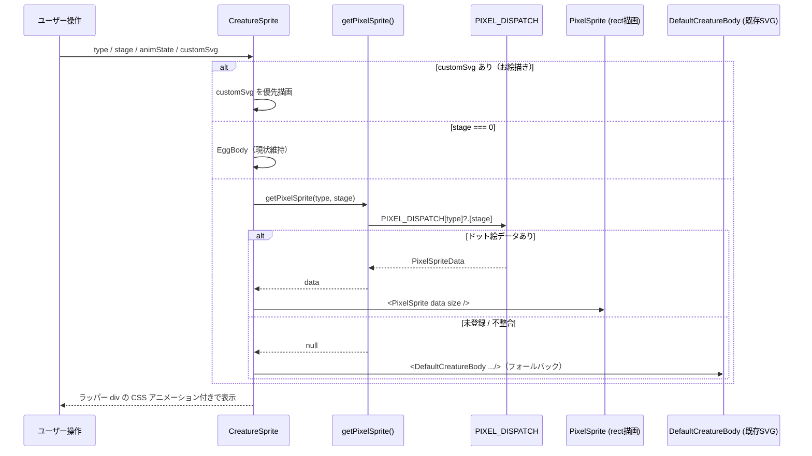
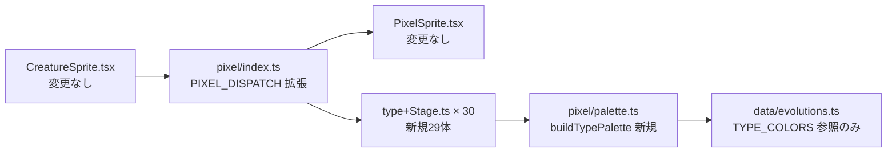

# 設計書: クリーチャーの32×32ドット絵スプライト全面移行

| 項目 | 内容 |
|------|------|
| 作成日 | 2026-06-20 |
| 担当 | バルベルデ（architecture-designer） |
| 関連要求 | `.steering/20260620-pixelart-sprites/requirements.md` |

---

## 1. 概要

### 設計方針サマリ

- **目的**: 6タイプ × 5ステージ = 30体すべてを 32×32 のドット絵スプライトへ移行し、`shapeRendering="crispEdges"` でドットがくっきり描かれるレトロ表示に統一する。タイプ別に一貫した配色・テーマ、ステージ別に成長を感じる体格差を持たせる。
- **方式**: 既存の汎用レンダラ `PixelSprite`（文字グリッド + パレット → 1セル `<rect>`）をそのまま活用し、データ（`<type><Stage>.ts`）を量産する。パレットは `TYPE_COLORS` のベース色から**アルゴリズムで生成するヘルパー `buildTypePalette()`**（後述 §3.2 / §10 Q1）に集約し、色のハードコーディングを排除する。
- **最小スコープ厳守**: レンダラ・呼び出し側（`CreatureSprite` / `getPixelSprite` のフォールバック機構）は**実装済みで変更しない**。今回はデータ追加と `PIXEL_DISPATCH` 登録、パレットヘルパー新設のみ。卵（stage 0）、アニメ state 別の表情差し替え、バトル/進化ロジックには触れない。
- **既存資産は壊さない**: `CreatureSprite` の props（`type`/`stage`/`animState`/`customSvg`）、`customSvg`（お絵描き）の優先経路、影・Zzz・！等の装飾オーバーレイ、CSS アニメーション（`animate-*`、ラッパー div の transform）はすべて維持。未移行・データ不整合時は従来 SVG（`DefaultCreatureBody`）へフォールバック。
- **ハードコーディング禁止**: 色は `palette.ts` の `buildTypePalette()` に集約。各スプライトデータは「グリッド（文字列配列）+ ベースタイプ参照」のみを持つ純粋な表示データとし、生の HEX を個別ファイルに散らさない。

### スコープ確定

| 項目 | 採用 |
|------|------|
| Q1: パレット方針 | **アルゴリズム生成 `buildTypePalette(base)` を採用**。`TYPE_COLORS` のベース色から濃影/影/ベース/ハイライトを HSL シフトで導出し、属性アクセント色のみタイプ別に手当て（requirements §8 Q1 対応 → §10 Q1） |
| Q2: 表情/アニメ state | **静止1枚で割り切る**。`PixelSprite` は `animState` を使わない現状を踏襲。将来拡張余地は §10 Q2 で1段落補足（requirements §8 Q2 対応） |
| Q3: ステージ別シルエット | **共通の基準シルエットテンプレを定義**し、その上にタイプ装飾を載せる。32×32 座標で頭身・接地・対称軸を固定（requirements §8 Q3 対応 → §3.3） |
| Q4: 描画最適化 | **セル単位 `<rect>` のまま据え置き**。30体・同時2体表示の規模では問題なし。水平ラン圧縮は将来必要時のみ（requirements §8 Q4 対応 → §10 Q4） |

---

## 2. アーキテクチャ図

> 本スプリントはフロントエンド単独の表示データ移行であり、バックエンド・DB・WebSocket プロトコルへの変更は**一切ない**。シーケンス図は「スプライト解決フロー」のみを示す。

### 2.1 スプライト解決フロー



### 2.2 モジュール構成（更新版）



---

## 3. コンポーネント設計

### 3.1 レンダラ・呼び出し側 — **変更なし**

| ファイル | 扱い |
|---------|------|
| `src/components/creatures/pixel/PixelSprite.tsx` | **変更なし**。`grid × palette → rect` の描画契約を踏襲。`PixelSpriteData` 型がデータ契約のソース・オブ・トゥルース |
| `src/components/CreatureSprite.tsx` | **変更なし**。`stage > 0` で `getPixelSprite()` を引き、null ならフォールバックする分岐は実装済み |
| `src/components/creatures/DefaultCreatureBody.tsx` | **変更なし**。未移行分のフォールバック先として温存 |

**設計上の重要点**

- レンダラに手を入れないため、本スプリントのリスクは「データの形式不整合」に限定される。これをテスト（§9）で機械的に封じ込める。
- `PixelSpriteData` は `{ grid: string[]; palette: Record<string,string> }`。各スプライトファイルは `palette` を `buildTypePalette()` の戻り値（＋アクセント拡張）で構築し、生 HEX を直書きしない。

### 3.2 パレット生成ヘルパー — `src/components/creatures/pixel/palette.ts`（新規）

ドット絵の陰影は「単純な明度上下」では沈んだ・濁った印象になる。プロト（`fireAdult.ts`）の実測値を HSL 分解すると、**影は彩度を落として沈め、ハイライトは色相を暖色側へ回して鮮やかに見せる**という王道技法が使われている（下表）。これをロジック化して全タイプへ一貫適用する。

| 役割 | プロト実測 (Fire) | H | S | L | 導出規則（base 相対） |
|------|------------------|---|---|---|----------------------|
| `l` ハイライト | `#ffac6b` | +10° | 100 | +11 | H+10, S そのまま, L+11（暖色回し） |
| `r` ベース | `#ff6b35` | 16 | 100 | 60 | base そのまま |
| `d` 影 | `#e0531f` | 16 | 76 | 50 | H同, **S×0.76**, L−10 |
| `o` 濃影 | `#b83c10` | 16 | 84 | 39 | H同, **S×0.84**, L−21 |
| `k` アウトライン | `#5a1700` | 15 | 100 | 18 | H同, S=100, L=18（固定の暗さ） |

> 補足: ハイライトの色相回し方向は「暖色は黄へ(+)、寒色は白み(S を下げる)」が自然。実装では `hueShiftTowardLight` をタイプ別に符号付きで持たず、**全タイプ +8°〜+12° の暖色回し＋ S を 5〜10 下げる**簡易ルールで十分レトロ感が出る（プロトの l は S=100 維持だが、寒色タイプで白飛びを防ぐため一律 S を僅かに落とす）。值は定数で集約する。

#### 関数シグネチャと生成ロジック

```ts
// src/components/creatures/pixel/palette.ts
import type { CreatureType } from '../../../types/creature'
import { TYPE_COLORS } from '../../../data/evolutions'

/** ドット絵の共通シェードキー。全スプライトでこの 6 キーを必ず用意する。 */
export interface TypePalette {
  k: string // outline（アウトライン）
  o: string // deep shadow（濃影）
  d: string // shadow（影）
  r: string // base（ベース＝TYPE_COLORS[type]）
  l: string // highlight（ハイライト）
  c: string // belly（お腹・クリーム＝全タイプ共通の固定色）
  w: string // eye white（目・白＝固定 '#ffffff'）
  b: string // pupil（瞳＝固定の暗色）
}

/** HSL 明度・彩度シフトの集約定数（マジックナンバー散逸を防ぐ）。 */
const SHADE = {
  highlight: { dh: +10, ds: -6,  dl: +11 },
  base:      { dh:   0, ds:   0, dl:   0 },
  shadow:    { dh:   0, dsFactor: 0.76, dl: -10 },
  deepShadow:{ dh:   0, dsFactor: 0.84, dl: -21 },
  outlineL: 18,           // アウトラインは常に L=18 の暗さに固定
} as const

const BELLY  = '#ffd9a8' // お腹（クリーム）共通
const EYE_W  = '#ffffff' // 目（白）
const PUPIL  = '#2a1a08' // 瞳（暗色・お腹より一段暗いニュートラル）

/** base 色（HEX）から 6 シェード + 固定色を生成する。 */
export function buildTypePalette(base: string): TypePalette {
  const [h, s, l] = hexToHsl(base)
  return {
    k: hslToHex(h,            100,                          SHADE.outlineL),
    o: hslToHex(h,            clampS(s * SHADE.deepShadow.dsFactor), l + SHADE.deepShadow.dl),
    d: hslToHex(h,            clampS(s * SHADE.shadow.dsFactor),     l + SHADE.shadow.dl),
    r: base,
    l: hslToHex(h + SHADE.highlight.dh, clampS(s + SHADE.highlight.ds), l + SHADE.highlight.dl),
    c: BELLY,
    w: EYE_W,
    b: PUPIL,
  }
}

/** タイプ → 完成パレット（属性アクセント色を merge）。 */
export function paletteFor(type: CreatureType): Record<string, string> {
  return { ...buildTypePalette(TYPE_COLORS[type]), ...TYPE_ACCENT[type] }
}

// hexToHsl / hslToHex / clampS は同ファイル内のローカルユーティリティ（純粋関数）
```

**属性アクセント色（タイプ別の手当て）**

陰影は自動生成で統一できるが、「炎の黄色」「雷の白」など**属性を象徴するアクセント色**だけはベース色から導けないため、タイプごとに 1〜2 色を明示的に持つ。キーは衝突しない `y`/`g`/`a`/`s` 等を使う（プロトの炎は `y`=明炎, `g`=中炎）。

```ts
const TYPE_ACCENT: Record<CreatureType, Record<string, string>> = {
  Fire:    { y: '#ffe06b', g: '#ff9a3c' }, // 炎: 黄〜橙
  Water:   { a: '#e8f7ff', s: '#2196f3' }, // 水: 白青ハイライト / 濃青しぶき
  Plant:   { a: '#c8e6a0', s: '#fff176' }, // 葉: 明緑 / 花・実の黄
  Thunder: { y: '#fffde7', a: '#fff176' }, // 雷: 白閃光 / 黄電
  Dark:    { a: '#7e57c2', s: '#e1bee7' }, // 闇: 紫炎 / 妖光ハイライト
  Light:   { a: '#ffffff', s: '#fff59d' }, // 光: 白輝 / 金光輪
  Normal:  {},                              // 進化スプライト無し（参照されない）
}
```

> アウトライン色・目（白黒）・お腹（クリーム）は `buildTypePalette` 側で全タイプ共通に確定（`k`/`w`/`b`/`c`）。属性アクセントのみ `TYPE_ACCENT` で拡張する二層構造とすることで、「陰影は一貫・属性は個性」を両立する。

**設計上の重要点**

- スプライトデータ側は `palette: paletteFor(type)` を呼ぶだけで生 HEX を持たない → ハードコーディング禁止を満たす。
- `buildTypePalette` は純粋関数で、HSL 変換も含めて外部依存ゼロ（追加ライブラリ禁止を満たす）。単独テスト可能。

### 3.3 ステージ別 基準シルエットテンプレ（Q3）

タイプごとに自由に描くと体格のブレ（特に同ステージ間の大きさ不一致）が出る。**32×32 座標で共通の基準シルエットを定義**し、各タイプはこの輪郭の内側を装飾する。共通ルールは以下に固定する。

**共通ルール**

| ルール | 値 | 理由 |
|--------|----|----|
| 左右対称軸 | x = 15.5（列15と16の境界） | 偶数幅 32px の中心。対称な体を取りやすい |
| 接地ライン | y = 27 前後（足裏） | y=28〜31 を影・余白に空け、ラッパー div の影と干渉させない |
| 上部余白 | y = 0〜1 は空ける | 角丸や炎の揺れ分のマージン |
| アウトライン | 体の外周は必ず `k` で囲う | レトロ感とステージ間の統一 |
| 目 | `w`(白) + `b`(瞳) の 2セル目を基本 | 静止1枚方針（§10 Q2） |

**ステージ別 体格基準（32×32 座標）**

| stage | 名称 | 頭身イメージ | 体高(y範囲) | 最大横幅 | 中心y | 接地y | シルエット方向性 |
|-------|------|-------------|------------|---------|-------|-------|----------------|
| 1 | Baby（ベイビー） | 2頭身・ほぼ球 | y 6〜26（約20px） | 16px | 16 | 26 | 丸い幼体。手足は小さな突起。頭＝体 |
| 2 | Child（チャイルド） | 2.5頭身 | y 4〜27（約23px） | 18px | 15 | 27 | 幼体に短い四肢が生える。目が大きい |
| 3 | Adult（アダルト） | 3頭身（プロト基準） | y 1〜28（約27px） | 18px | 14 | 28 | 二足の獣。頭部装飾＋しっぽ。**プロト `fireAdult` が基準** |
| 4 | Perfect（パーフェクト） | 3.5頭身 | y 0〜29（約29px） | 22px | 14 | 29 | 大型化。翼・角・追加装飾で迫力 |
| 5 | Ultimate（アルティメット） | 4頭身・最大 | y 0〜30（約30px） | 26px | 14 | 30 | グリッドいっぱい。重厚な装甲/光背 |

> 「成長を感じる体格差」は **横幅と接地までの体高で表現**する（Baby 16px幅 → Ultimate 26px幅）。頭身は段階的に伸ばすが、32px の制約上 4頭身が上限。

**基準シルエット（輪郭のみ・タイプ装飾を載せる土台）**

`#` = アウトライン+体（塗り領域の外周目安）、`.` = 透明。各タイプはこの内側を `r`/`d`/`o`/`l`/`c` と装飾で埋める。

stage 1 — Baby（丸い幼体・16px幅）
```
................................
................................
................................
................................
................................
................................
............########............
..........############..........
.........##############.........
........################........
........################........
........################........
........################........
........################........
........################........
........################........
........################........
........################........
........################........
.........##############.........
..........############..........
............########............
.............#....#.............
.............#....#.............
.............#....#.............
............##....##............
................................
................................
................................
................................
................................
................................
```

stage 2 — Child（短い四肢・18px幅）
```
................................
................................
................................
...........##########...........
.........##############.........
........################........
.......##################.......
.......##################.......
.......##################.......
.......##################.......
.......##################.......
.......##################.......
.......##################.......
.......##################.......
........################........
........################........
.........##############.........
..........############..........
..........############..........
.........##.##....##.##.........
.........##.##....##.##.........
.........##.........##.........
.........##.........##.........
.........###.......###..........
.........###.......###..........
.........####.....####..........
..........###.....###...........
................................
................................
................................
................................
................................
```

stage 3 — Adult（二足の獣・18px幅・プロト `fireAdult` 準拠）
```
................................
..........(頭部装飾 type別)......
................................
.........###############........
........#################........
........#################........
.......###################.......
.......###################.......
.......###################.......
.......###################.......
.......###################.......
.......###################.......
.......###################.......
.......###################.......
........#################........
........#################........
........#################........
........#################........
........#################........
.........###############........
.........###############........
..........#############.........
..........#############.........
..........####.....####.........
..........####.....####.........
.........#####.....#####........
.........#####.....#####........
.........#####.....#####........
................................
................................
................................
................................
```

stage 4 — Perfect（大型・翼/角・22px幅）
```
................................
.....(角/翼 type別)..............
.......##################.......
......####################......
.....######################.....
.....######################.....
....########################....
....########################....
....########################....
....########################....
....########################....
....########################....
....########################....
.....######################.....
.....######################.....
.....######################.....
......####################......
......####################......
.......##################.......
.......##################.......
........################........
........####......####..........
.......#####......#####.........
.......#####......#####.........
......######......######........
......######......######........
......######......######........
......######......######........
................................
................................
................................
................................
```

stage 5 — Ultimate（最大・光背/装甲・26px幅）
```
.....(光背/巨大装飾 type別)......
......######################......
.....########################.....
....##########################....
...############################...
...############################...
...############################...
..##############################..
..##############################..
..##############################..
..##############################..
..##############################..
..##############################..
...############################...
...############################...
...############################...
...############################...
....##########################....
....##########################....
.....########################.....
.....########################.....
......######....######............
.....#######....#######...........
.....#######....#######...........
....########....########..........
....########....########..........
....########....########..........
....########....########..........
....########....########..........
................................
................................
................................
```

> 上記は**輪郭の方向性ガイド**であり、ピクセル単位の正確な実装ではない。実装者はこの基準内に収め、`k` で外周を囲い、内部を陰影（`l` 上面/`r` 中央/`d`・`o` 下面）で立体化する。プロト `fireAdult.ts` を「陰影・目・お腹・脚の塗り分けの教科書」として全ステージ・全タイプで踏襲する。

### 3.4 タイプ別ビジュアルモチーフ（量産時のブレ防止）

| タイプ | ベース色 | モチーフ（1〜2行） |
|--------|---------|-------------------|
| Fire | `#ff6b35` | 頭やしっぽに**炎**（`y`明/`g`中）。赤橙の獣。プロト基準。攻撃的な目 |
| Water | `#4fc3f7` | 体は青、**ヒレ・水しぶき**（`a`白青/`s`濃青）。丸みのある水棲生物。お腹は淡色 |
| Plant | `#81c784` | 頭に**葉・芽・花**（`a`明緑/`s`黄の実）。緑の草食的な体。穏やかな目 |
| Thunder | `#ffd54f` | **稲妻のトゲ・帯電エフェクト**（`y`白閃/`a`黄電）。黄色い俊敏な体。ギザギザ輪郭 |
| Dark | `#ce93d8` | **紫の影・角・妖光**（`a`紫炎/`s`妖光）。紫黒の不気味な体。鋭い目 |
| Light | `#fff9c4` | **光輪・翼・白輝**（`a`白輝/`s`金光）。淡黄〜白の神聖な体。優しい目 |

---

## 4. データ構造設計

### 4.1 スプライトデータファイルの規約

各 `<type><Stage>.ts` は以下の形を厳守する（`fireBaby.ts`〜`lightUltimate.ts`、計30体。`fireAdult.ts` は既存・据え置き）。

```ts
// 例: src/components/creatures/pixel/waterChild.ts
import type { PixelSpriteData } from './PixelSprite'
import { paletteFor } from './palette'

// prettier-ignore
const grid: string[] = [ /* 32 行 × 32 文字 */ ]

export const waterChildPixel: PixelSpriteData = { grid, palette: paletteFor('Water') }
```

| 規約 | 内容 |
|------|------|
| エクスポート名 | `<type><Stage>Pixel`（例 `waterChildPixel`）。camelCase |
| ステージ語 | stage 1=`Baby`, 2=`Child`, 3=`Adult`, 4=`Perfect`, 5=`Ultimate`（`STAGE_NAMES` 英語対応） |
| grid | 厳密に 32 要素・各 32 文字。`'.'` は透明 |
| palette | `paletteFor(type)` 由来のキーのみ使用。生 HEX 直書き禁止 |

### 4.2 ディスパッチ登録 — `src/components/creatures/pixel/index.ts`（変更）

`PIXEL_DISPATCH` を 6タイプ × 5ステージ = 30 エントリに拡張する。`getPixelSprite()` のシグネチャ・フォールバック契約は不変。

```ts
const PIXEL_DISPATCH: Partial<Record<CreatureType, Partial<Record<EvolutionStage, PixelSpriteData>>>> = {
  Fire:    { 1: fireBabyPixel,    2: fireChildPixel,    3: fireAdultPixel,    4: firePerfectPixel,    5: fireUltimatePixel },
  Water:   { 1: waterBabyPixel,   2: waterChildPixel,   3: waterAdultPixel,   4: waterPerfectPixel,   5: waterUltimatePixel },
  Plant:   { 1: plantBabyPixel,   2: plantChildPixel,   3: plantAdultPixel,   4: plantPerfectPixel,   5: plantUltimatePixel },
  Thunder: { 1: thunderBabyPixel, 2: thunderChildPixel, 3: thunderAdultPixel, 4: thunderPerfectPixel, 5: thunderUltimatePixel },
  Dark:    { 1: darkBabyPixel,    2: darkChildPixel,    3: darkAdultPixel,    4: darkPerfectPixel,    5: darkUltimatePixel },
  Light:   { 1: lightBabyPixel,   2: lightChildPixel,   3: lightAdultPixel,   4: lightPerfectPixel,   5: lightUltimatePixel },
}
```

> `Normal` は進化スプライトを持たない（`EVOLUTION_NAMES` 上も汎用名）。`PIXEL_DISPATCH` に登録せず、従来どおりフォールバック（`FallbackSilhouette` 経由）に委ねる。

---

## 5. 状態遷移

該当なし（表示専用データの追加であり、ランタイム状態を持たない）。

---

## 6. エラーハンドリング

| シナリオ | 挙動 |
|---------|------|
| 未移行の type×stage | `getPixelSprite` が `null` → `DefaultCreatureBody`（既存SVG）へフォールバック。画面は壊れない |
| grid が 32×32 でない / 未定義文字混入 | **ビルド時のテスト（§9）で検出**しCIで弾く。ランタイムには到達させない |
| `customSvg` 指定時 | 従来どおり最優先で描画（ドット絵を引かない） |
| stage 0（卵） | `EggBody`（現状維持） |

> ランタイムでの防御的分岐は不要。レンダラ `PixelSprite` は palette に無い文字を黙って透明スキップするため、最悪でも「欠けたドット」で表示が壊れない。整合性はテストで前倒し保証する。

環境変数・タイムアウト値は本スプリックでは新設しない。

---

## 7. データモデル / DB 設計

該当なし（バックエンド・DB への変更なし）。

---

## 8. 影響範囲

### 8.1 変更/新規ファイル

| ファイル | 種別 | 内容 |
|---------|------|------|
| `src/components/creatures/pixel/palette.ts` | 新規 | `buildTypePalette` / `paletteFor` / `TYPE_ACCENT` / HSL ユーティリティ |
| `src/components/creatures/pixel/fireBaby.ts` 〜 `fireUltimate.ts`（Adult除く4体） | 新規 | Fire の残り4ステージ |
| `src/components/creatures/pixel/water*.ts`（5体） | 新規 | Water 全ステージ |
| `src/components/creatures/pixel/plant*.ts`（5体） | 新規 | Plant 全ステージ |
| `src/components/creatures/pixel/thunder*.ts`（5体） | 新規 | Thunder 全ステージ |
| `src/components/creatures/pixel/dark*.ts`（5体） | 新規 | Dark 全ステージ |
| `src/components/creatures/pixel/light*.ts`（5体） | 新規 | Light 全ステージ |
| `src/components/creatures/pixel/fireAdult.ts` | 変更（任意） | `palette` を `paletteFor('Fire')` 由来に寄せる（任意・整合のため推奨） |
| `src/components/creatures/pixel/index.ts` | 変更 | `PIXEL_DISPATCH` を 30 エントリへ拡張 |
| `src/components/creatures/pixel/__tests__/pixelSprites.test.ts` | 新規 | 整合性テスト（§9） |

> 新規スプライトデータは合計 **29体**（Fire Adult 済み）。`fireAdult.ts` のパレットを `paletteFor('Fire')` に揃えるかは任意（プロト承認済みの色を厳密維持したいなら現状の手書きパレットのままでも可。その場合 `buildTypePalette` の生成値がプロト実測とズレないことをテストで突き合わせると尚良い）。

### 8.2 既存機能への影響

| 機能 | 影響 | 緩和策 |
|------|------|------|
| `CreatureSprite` / フォールバック分岐 | なし（変更しない） | — |
| `customSvg`（お絵描き） | なし（最優先経路を維持） | — |
| CSS アニメーション・装飾オーバーレイ | なし（ラッパー div 側で適用、中身の差し替えに非依存） | — |
| 既存 SVG スプライト群 | なし（フォールバック先として温存） | 全移行後も削除しない（無停止移行・安全網） |
| `DefaultCreatureBody` の `getExpression` 等 | なし | 静止1枚方針のため未使用化するが残置 |

---

## 9. PoC スコープと成功基準

### 9.1 検証項目（受け入れ条件への対応 / ギュレル向けテスト仕様）

`src/components/creatures/pixel/__tests__/pixelSprites.test.ts` に以下を実装する。`PIXEL_DISPATCH` を `index.ts` から export して全登録データを走査する。

| # | 受け入れ条件 | テスト内容 |
|---|-------------|-----------|
| T1 | グリッドが厳密に 32×32 | 全 `PixelSpriteData` について `grid.length === 32` かつ各行 `row.length === 32` |
| T2 | 未定義文字の検出 | grid 中の各文字が `palette` のキー、または透明文字 `'.'` のいずれかであること（それ以外が1つでもあれば失敗。座標を含むメッセージで） |
| T3 | 30体すべて登録 | `PIXEL_DISPATCH` が 6タイプ × 5ステージ = 30 の組を**すべて**持つこと（タイプ×ステージを二重ループで検査し、欠けを列挙） |
| T4 | パレット必須キー | 各 palette が共通シェードキー `k/o/d/r/l/c/w/b` を含むこと（陰影の欠落防止） |
| T5 | パレット生成の純粋性 | `buildTypePalette('#ff6b35')` が決定的な HEX を返し、`k/o/d/r/l` が「base より暗い順序（L: o<d<r かつ l>r、k 最暗）」を満たすこと |

**テスト品質の遵守事項（CLAUDE.md）**
- `expect(true).toBe(true)` のような無意味アサーション禁止。各テストは具体的な入力（実データ）と期待値を検証する。
- 本番コードに `if (testMode)` 等のテスト用分岐・マジック値を入れない。テストは公開データ・公開関数のみを対象とする。
- 透明文字の許容（`'.'`）は仕様。T2 ではこれを明示的にホワイトリストし、それ以外の未定義文字のみを失格とする。

### 9.2 計測指標

| 指標 | 目標 | 計測点 |
|------|------|-------|
| 同時表示 | バトル時 2体同時でカクつきなし | 体感確認（`verify` スキル） |
| rect 数 | 1体あたり最大 32×32=1024、実塗りは数百 | 30体・2体表示で最大 ~2000 rect。React の静的描画として問題ない規模 |
| ビルド | `npm run build` / `npm run test:run` / `npm run lint`（max-warnings 0）通過 | CI |

**理論値**: 1体の `<rect>` 数は塗りセルのみ（透明スキップ）で実測 200〜500 程度。同時2体で最大 ~1000 rect、メイン画面の一覧でも 1画面1体が基本。SVG の静的 rect は再レンダリングを伴わず、ブラウザのラスタライズも 32×32 viewBox なら軽量。**セル単位 `<rect>` で性能上の懸念なし**（Q4 の据え置き判断の根拠）。

### 9.3 失敗時のフォールバック

- あるタイプ/ステージのドット絵が間に合わない場合 → `PIXEL_DISPATCH` に登録しなければ自動で従来 SVG にフォールバックするため、**部分リリースが安全に可能**（無停止移行）。
- パレット自動生成が特定タイプで発色不良（例: Light の淡色で陰影が潰れる）→ そのタイプのみ `TYPE_ACCENT` で `r`/`d` を手当て上書き、または `paletteFor` の戻りを部分的に差し替え。ロジック自体は変えない。

---

## 10. 未確定事項・要シャビ判断

### 10.1 Q1〜Q4 の判断（バルベルデ推奨）

#### Q1: パレット方針 — アルゴリズム生成 vs タイプ別手調整

| 案 | トレードオフ | 推奨 |
|----|--------------|------|
| **A. `buildTypePalette()` で HSL シフト自動生成＋属性アクセントのみ手当て** | ◎ 全タイプで陰影が一貫・ハードコーディング集約・追加29体が高速量産。△ 淡色タイプ(Light)で陰影が弱まる可能性 → アクセント手当てで吸収 | **採用** |
| B. タイプ別に完全手調整パレット | ◎ 各タイプ最適発色。△ 30体ぶん HEX が散逸しブレ・保守難・ハードコーディング禁止に抵触 | 不採用 |

**推奨理由**: プロト `fireAdult` の実測パレットが既に「base からの規則的 HSL シフト」で説明できる（§3.2 の実測表）。これを関数化すれば**プロトの品質を全タイプに横展開**でき、かつ色を1箇所に集約してハードコーディング禁止を満たす。属性の象徴色だけは色相から導けないため `TYPE_ACCENT` で二層化する折衷が最適。淡色タイプの陰影潰れは §9.3 のとおり局所上書きで対処可能で、ロジックを壊さない。

#### Q2: 表情/アニメ state 対応 — 静止1枚で割り切る

**採用: 静止1枚**（`PixelSprite` は `animState` を使わない現状踏襲）。requirements §3.2・§8 Q2 のとおり、表情差し替えは本スプリック対象外。動きはラッパー div の CSS アニメーション（跳ねる・揺れる・点滅）が担い、ドット絵自体は静止で十分レトロ感が出る。

**将来拡張余地（1段落）**: 表情を付けたくなった場合、`PixelSpriteData` に `overlays?: Partial<Record<AnimState, { grid; palette }>>` を追加し、`PixelSprite` が base grid の上に目/口だけの小グリッドを重ねる方式が低コスト。`DefaultCreatureBody.getExpression`（`eye`/`mouth` バリアント）の設計をそのまま流用できる。本体グリッドは共通のまま差分オーバーレイのみ持つため、データ量も最小。今回は実装しないが、データ契約に後方互換で追加できる設計のため将来分岐は不要。

#### Q3: ステージ別シルエット — 共通基準テンプレ採用

**採用: 共通の基準シルエットテンプレ**（§3.3）。タイプごとの自由描画はステージ間の大きさ不一致を生むため、32×32 座標で頭身・接地（y≈27前後）・対称軸（x=15.5）を固定し、その内側にタイプ装飾を載せる。成長感は横幅（16→26px）と体高で表現。プロト `fireAdult` を stage 3 の基準実装とする。

#### Q4: 描画最適化 — セル単位 `<rect>` 据え置き

**採用: 据え置き**。§9.2 の理論値どおり 30体・同時2体表示の規模では rect 単位で性能問題なし。`PixelSprite` の単純さ（保守性・テスト容易性）を優先する。**将来**、一覧で多数同時表示するなど rect 数が問題化したら、同色の水平連続セルを1つの `<rect>`（`width>1`）にまとめる水平ラン圧縮を `PixelSprite` 内に閉じて導入できる（データ契約は不変）。

### 10.2 残る未確定事項（実装中にシャビ判断が必要になる可能性）

| # | 項目 | 内容 |
|---|------|------|
| Q5 | 各タイプ・各ステージの具体的なドット絵デザイン | §3.4 のモチーフ・§3.3 のシルエットを土台にするが、最終的な「かわいさ/かっこよさ」はゲームデザイン上の見た目判断。**実装した各スプライトはシャビの目視承認を得る**（ステータス/バランスには非干渉だが見た目は要確認） |
| Q6 | `fireAdult.ts` のパレットを `paletteFor('Fire')` に寄せるか | プロト承認済みの手書き色を厳密維持するか、生成パレットへ統一するか（T5 で生成値とプロト実測の差を可視化してから判断） |

---

## 設計品質チェック

- **セキュリティ**: 表示専用の静的データのみ。外部入力・ユーザー入力を描画に流用しない。`customSvg` の既存 DOMPurify 経路は変更しない。インジェクション面なし。
- **テスタビリティ**: パレット生成は純粋関数、スプライトは静的データ。`PIXEL_DISPATCH` 走査で30体を機械検査でき、不整合をCIで前倒し検出（T1〜T5）。
- **モジュール性**: レンダラ/呼び出し側は不変。新規は「パレットヘルパー1本＋データ29体」のみで責務が明確。`buildTypePalette`（陰影）と `TYPE_ACCENT`（属性）を分離。
- **コスト効率**: 追加ライブラリゼロ。HSL 変換も内製の純粋関数。
- **保守性**: 色は `palette.ts` に集約（ハードコーディング禁止）。シルエット基準で量産時のブレを抑制。将来の表情オーバーレイ・ラン圧縮を後方互換で追加できる契約設計。
- **互換性/無停止移行**: 未登録は自動フォールバック。既存 SVG は安全網として残置し、部分リリース可能。

---

作成: バルベルデ / 2026-06-20
