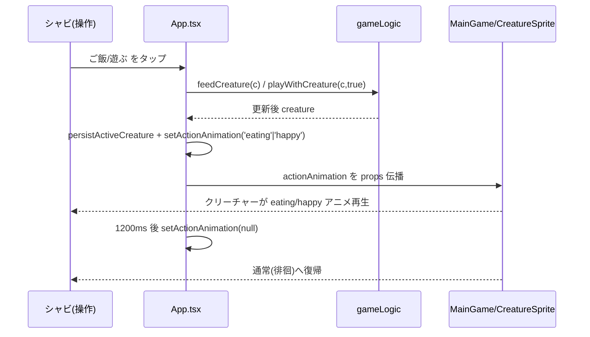
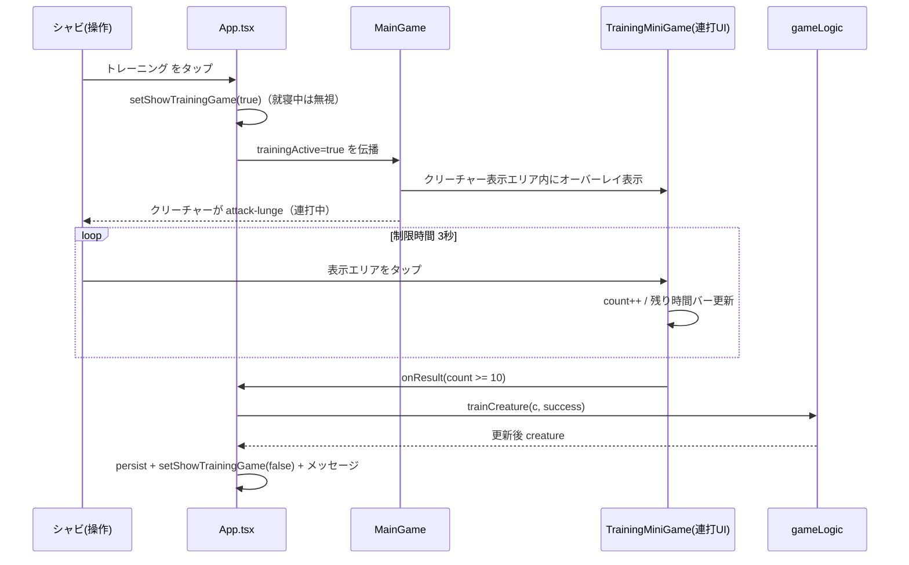
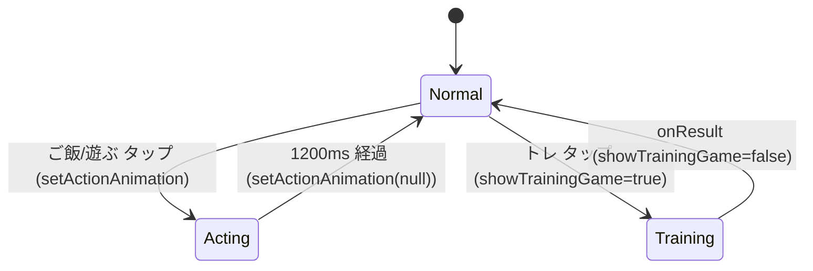

# 設計書: トレーニングのミニゲーム復活とクリーチャーアクション演出追加

| 項目 | 内容 |
|------|------|
| 作成日 | 2026-06-20 |
| 担当 | モドリッチ（architecture-designer バルベルデ相当の判断を代行） |
| 関連要求 | `.steering/20260620-training-minigame-creature-action/requirements.md` |

---

## 1. 概要

### 設計方針サマリ

- **目的**: トレーニングを**メイン画面内で完結する連打ミニゲーム**にし、ごはん/遊びは即時のままクリーチャーのアクション演出（eating/happy）を足す。
- **方式**: ①トレは `TrainingMiniGame`（連打UI）を**クリーチャー表示エリア内にオーバーレイ**。モーダルは使わない。クリーチャーは MainGame が描画したまま attack-lunge を再生。②ごはん/遊びは既存 `attackAnimation: boolean` を `actionAnimation: ActionAnim | null` に一般化し、transient state で eating/happy を一定時間再生。
- **最小スコープ厳守**: 効果量・バランス数値は不変。新規スプライト・新規アニメCSSは作らない（既存の tailwind アニメ `eat-nod`/`happy-jump`/`attack-lunge` を使う）。
- **既存資産は壊さない**: 徘徊アニメ（walk/rest）、卵ふ化、進化グロー、満腹/就寝ガードは維持。
- **ハードコーディング禁止**: 本変更でURL/シークレット等は発生しない。アニメ尺は名前付き定数に集約。

### スコープ確定

| 論点 | 採用 |
|------|------|
| Q1: アニメ配線方式 | **A. `actionAnimation: ActionAnim｜null` へ一般化**（個別 boolean を増やすより拡張容易・状態が一意） |
| Q2: トレの形態 | **連打（サンドバッグ）・メイン画面内オーバーレイ**（モーダル不使用）。制限時間内に規定回数タップで成功 |
| Q3: アニメ再生時間 | 共通定数 `ACTION_ANIM_MS = 1200`（ごはん/遊びの transient 解除）。トレ連打中は MainGame が attack を上書き表示 |

### トレーニング連打のバランス数値（要シャビ承認）

| 項目 | 既定値 | 定数 |
|------|--------|------|
| 制限時間 | 3000ms | `TRAIN_DURATION_MS` |
| 目標タップ数 | 10回 | `TRAIN_TARGET_TAPS` |

> 達成可否がそのまま `trainCreature(c, success)` の成否に対応。効果量自体は不変。

---

## 2. アーキテクチャ図

### 2.1 シーケンス図（ごはん／遊び：即時＋演出）



### 2.2 シーケンス図（トレーニング：連打・メイン画面内）



---

## 3. コンポーネント設計

### 3.1 型定義 — `src/utils/gameLogic.ts`

```ts
// アクション演出の種別（メイン画面で一時的に再生するアニメ）
export type ActionAnim = 'attack' | 'eating' | 'happy'

// 第2引数を boolean → ActionAnim｜null に一般化（後方互換のためデフォルト null）
export function getAnimationState(
  creature: Creature,
  actionOverride: ActionAnim | null = null
): 'idle' | 'happy' | 'sleeping' | 'attack' | 'eating' | 'evolving' | 'dead' | 'sad' | 'hungry' | 'critical' {
  if (!creature.isAlive) return 'dead'
  if (actionOverride) return actionOverride   // dead 以外より優先（明示アクションの即時フィードバック）
  if (creature.isSleeping) return 'sleeping'
  // 以下、既存の優先順位（critical → hungry → sad → happy → idle）はそのまま
}
```

**設計上の重要点**

- 戻り型に `'eating'` を追加（`CreatureSprite` は既に `eating` を処理済み＝表示側は無改修）。
- 優先順位は「dead > actionOverride > sleeping > ...」。ごはん/遊び/トレは就寝中ガードがあるため、actionOverride と sleeping が同時に立つことはない。

### 3.2 メイン画面 — `src/App.tsx`

```ts
type ActionAnim = 'attack' | 'eating' | 'happy'
const ACTION_ANIM_MS = 1200

const [actionAnimation, setActionAnimation] = useState<ActionAnim | null>(null)
const [showTrainingGame, setShowTrainingGame] = useState(false)
const actionTimerRef = useRef<ReturnType<typeof setTimeout> | null>(null)

// 一時アニメを再生して自動解除（多重発火に耐える）
const triggerAction = useCallback((kind: ActionAnim) => {
  if (actionTimerRef.current) clearTimeout(actionTimerRef.current)
  setActionAnimation(kind)
  actionTimerRef.current = setTimeout(() => setActionAnimation(null), ACTION_ANIM_MS)
}, [])

// ごはん：即時＋eating（満腹ガード維持）
const handleFeed = useCallback(() => {
  const c = creatureRef.current
  if (!c || c.hunger >= 100) { /* 満腹メッセージ */ return }
  persistActiveCreature(feedCreature(c))
  triggerAction('eating')
  showMessage('もぐもぐ！ご飯を食べた！')
}, [...])

// 遊び：即時＋happy（就寝中ガード維持）
const handlePlay = useCallback(() => {
  const c = creatureRef.current
  if (!c || c.isSleeping) return
  persistActiveCreature(playWithCreature(c, true))
  triggerAction('happy')
  showMessage('一緒に遊んだ！楽しかった！')
}, [...])

// トレ：ミニゲームを開く（就寝中ガード維持）
const handleTrain = useCallback(() => {
  const c = creatureRef.current
  if (!c || c.isSleeping) return
  setShowTrainingGame(true)
}, [])

// ミニゲーム結果：trainCreature(c, success) を適用
const handleTrainResult = useCallback((success: boolean) => {
  const c = creatureRef.current
  if (c) { persistActiveCreature(trainCreature(c, success));
           showMessage(success ? 'トレーニング成功！強くなった！' : 'トレーニング失敗…でも経験になった') }
  setShowTrainingGame(false)
}, [...])
```

**設計上の重要点**

- `actionTimerRef` で連打時の二重タイマーを防ぐ（前のタイマーを clear）。unmount 時は cleanup で clear。
- `attackAnimation` という旧名・旧 boolean state は廃止し `actionAnimation` に統合。MainGame の prop も合わせて改名。

### 3.3 メイン画面表示 — `src/components/MainGame.tsx`

- prop `attackAnimation: boolean` → `actionAnimation: ActionAnim | null` に変更。
- **新規 prop**: `trainingActive: boolean`, `onTrainResult: (success: boolean) => void`。
- `const animState = getAnimationState(creature, actionAnimation)`。
- 徘徊（ambient）の発火条件に「アクション中・トレ中は止める」を追加:
  `const ambient = !isEgg && !actionAnimation && !trainingActive && (animState === 'idle' || animState === 'happy')`
- 連打中はクリーチャーを attack 表示に上書き:
  `const spriteAnim = trainingActive ? 'attack' : <既存の spriteAnim 算出>`
- クリーチャー表示エリア（`relative` な div）内に、`trainingActive` のとき `TrainingMiniGame` を `absolute inset-0` でオーバーレイ:
  `{trainingActive && <TrainingMiniGame color={color} onResult={onTrainResult} />}`

### 3.4 トレーニング連打UI — `src/components/TrainingMiniGame.tsx`（新規・オーバーレイ）

```ts
interface Props {
  color: string                       // ブランチ色（装飾用）
  onResult: (success: boolean) => void
}
const TRAIN_DURATION_MS = 3000
const TRAIN_TARGET_TAPS = 10
```

- **モーダルではなくオーバーレイ**: クリーチャー表示エリア内に `absolute inset-0` で重ねる。背景は薄い半透明のみ（クリーチャーが透けて見える）。クリーチャー自体はこのコンポーネントでは描画しない（MainGame が描画）。
- 状態: `count`（タップ数）, `timeLeft`（残りms）, `phase: 'active' | 'done'`。
- マウント時に即 active 開始。`setInterval` で残り時間を減算、0 で `phase='done'` → `onResult(count >= TRAIN_TARGET_TAPS)`。
- エリア全体を透明なタップ領域（button）にし、タップで `count++`（active 中のみ）。
- 表示: 上部に「連打！」、残りタップ数 `TRAIN_TARGET_TAPS - count`（0 で「OK!」）、残り時間バー。
- タイマーは unmount / done で確実に clear（リーク防止）。
- ブランチ色で装飾（既存トーン踏襲）。

### 3.5 既存処理の改造ポイント

| 既存処理 | 変更 |
|---------|------|
| `gameLogic.getAnimationState(c, isAttacking)` | 第2引数を `ActionAnim｜null` に一般化、戻り値に `'eating'` 追加 |
| `App.tsx` `attackAnimation` state | `actionAnimation: ActionAnim｜null` に置換、`triggerAction` 追加 |
| `App.tsx` `handleFeed/handlePlay` | 即時適用は維持しつつ `triggerAction('eating'/'happy')` 追加 |
| `App.tsx` `handleTrain` | 即時適用 → `setShowTrainingGame(true)` に変更、`handleTrainResult` 追加 |
| `App.tsx` トレ描画 | フルスクリーン `TrainingMiniGame` → MainGame に `trainingActive`/`onTrainResult` を渡す方式へ |
| `MainGame` | prop 改名 + `trainingActive`/`onTrainResult` 追加、連打UIをエリア内オーバーレイ、連打中は attack 上書き |
| `TrainingMiniGame` | 連打UI（オーバーレイ）として作り直し。クリーチャーは描画しない |
| `CreatureSprite` | **変更なし**（`eating` は既に処理済み） |
| `gameLogic` 効果量（feed/train/play） | **変更なし**（既知ナレッジ厳守） |

---

## 4〜7. プロトコル/DB/データモデル

**N/A** — バックエンド・DB・API・永続スキーマの変更なし。クライアント内のローカル状態とアニメ配線のみ。

---

## 5. 状態遷移（メイン画面のアクションアニメ）



---

## 6. エラーハンドリング

| シナリオ | 挙動 |
|---------|------|
| ごはん/遊び/トレ 連打 | `triggerAction` が前タイマーを clear、トレはモーダル多重表示を state で抑止 |
| アニメ中に unmount | useEffect cleanup で `actionTimerRef` を clear（リーク防止） |
| ミニゲーム中に時間更新で死亡 | `handleTrainResult` 内で creature 取得時に存在チェック、死亡時は trainCreature が no-op（既存ガード） |

---

## 8. 影響範囲

### 8.1 変更/新規ファイル

| ファイル | 種別 | 内容 |
|---------|------|------|
| `src/components/TrainingMiniGame.tsx` | 新規 | クリーチャー表示付き2分の1ミニゲーム |
| `src/utils/gameLogic.ts` | 変更 | `getAnimationState` 一般化、`ActionAnim` 型 export |
| `src/App.tsx` | 変更 | `actionAnimation` state・`triggerAction`・トレのミニゲーム配線 |
| `src/components/MainGame.tsx` | 変更 | prop 改名・ambient ガード・TrainingMiniGame は App 側で描画 |

### 8.2 既存機能への影響

| 機能 | 影響 | 緩和策 |
|------|------|------|
| ごはん/遊びの即時発動 | なし（即時のまま） | 演出は非同期の transient で上乗せ |
| 徘徊アニメ | 軽微（アクション中は一時停止） | `!actionAnimation` ガードで意図通り制御 |
| バトルの attack 演出 | なし | バトルは別画面・別経路 |
| 効果量・バランス | なし | gameLogic 不変 |

---

## 9. 検証（受け入れ条件への対応）

| 受け入れ条件 | 検証方法 |
|-------------|---------|
| トレでミニゲーム＋クリーチャー表示 | verify: トレ → モーダルにクリーチャーと左右ボタン |
| 2分の1成否で成長量が変わる | verify: 複数回試行し成功/失敗メッセージと成長差を確認 |
| ごはん即時＋eating | verify: ご飯 → 遷移なし・空腹増加・クリーチャーが eating |
| 遊び即時＋happy | verify: 遊ぶ → 遷移なし・クリーチャーが happy |
| 効果量不変 | gameLogic.ts の diff がアニメ配線のみ（効果量行に変更なし） |
| build/test グリーン | `npm run build` / `npm run test:run` |

---

## 10. 未確定事項・要シャビ判断

#### Q1: アニメ配線方式（確定）

| 案 | トレードオフ | 推奨 |
|----|--------------|------|
| **A. `actionAnimation: ActionAnim｜null` に一般化** | state が一意・拡張容易・旧 boolean を置換 | ✅ 採用 |
| B. `eatAnimation`/`playAnimation` 個別 boolean | 変更小だが state 増殖・同時発火管理が煩雑 | 不採用 |

**推奨理由**: 今後アクションが増えても列挙を足すだけで済む。複数アニメが同時に立つ不整合を型で排除できる。

### 10.2 残る未確定事項

| # | 項目 | 内容 |
|---|------|------|
| Q2 | ミニゲームの成否テキスト文言 | 実装時に既存トーンに合わせる（シャビ判断不要なら現案で確定） |

---

## 設計品質チェック

- セキュリティ: ユーザー入力描画なし・固定文字列のみ・認証認可に無関係 → 攻撃面の増加なし
- テスタビリティ: `getAnimationState` の actionOverride 分岐は単体テスト可能。`TrainingMiniGame` の成否は乱数依存だが onResult 配線はテスト可能
- モジュール性: `CreatureSprite` は無改修、表示と状態管理を分離
- コスト効率: 追加依存ゼロ、CSSアニメで完結
- 保守性: `ActionAnim` 列挙で将来のアクション追加に対応

---

作成: モドリッチ / 2026-06-20
