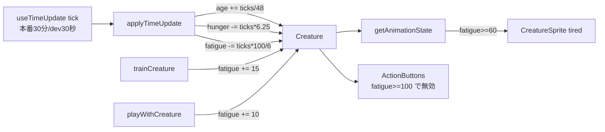

# 設計書: 成長システム リアルタイム化リデザイン

| 項目 | 内容 |
|------|------|
| 作成日 | 2026-06-21 |
| 担当 | バルベルデ（architecture-designer） / モドリッチ代筆 |
| 関連要求 | `.steering/20260621-growth-realtime-redesign/requirements.md` |

---

## 1. 概要

### 設計方針サマリ

- **目的**: 年齢=現実1日/歳、おなか=時間経過のみ約8h空腹、裏パラメータ「疲労度」追加（トレ/遊ぶで蓄積・MAXで実行不可）。
- **方式**: 既存の 30分ティック方式（`applyTimeUpdate`）を**踏襲し、レート定数を差し替え**。`fatigue` フィールドを追加し、疲労はモーション（`AnimState='tired'`）で表現。
- **最小スコープ厳守**: 時間更新アーキテクチャ（`elapsed / thirtyMinutes` 追いつき計算、ティック構造）は変えない。バトル・EXP・ステ成長・special には触れない。
- **既存資産は壊さない**: feed(+30)・幸福度・睡眠/照明・HP回復・餓死・オフライン追いつき・セーブ互換を維持。
- **ハードコーディング禁止**: 全ての成長レート/しきい値は `gameLogic.ts` の名前付き定数に集約（マジックナンバー散在を排除）。

### スコープ確定（requirements §8 への回答）

| 項目 | 採用 |
|------|------|
| Q1 既存セーブの age 移行 | **移行しない**。旧「時間」値をそのまま「日」として扱う（個人ゲーム・少数セーブ・実装単純性を優先） |
| Q2 進化時に fatigue リセット | **しない（引き継ぎ）**。`evolveCreature` は fatigue を変更しない。進化直後の疲労は時間で自然回復 |
| Q3 餓死時(hunger<=0)のトレ/遊ぶ禁止 | **維持**。`ActionButtons` の `hunger<=0` 無効化はそのまま残し、`fatigue>=MAX` 無効化を AND で追加 |
| Q4 疲労中モーションの実装 | **ラッパーアニメで表現**。`getAnimClass` に `tired` ケース（緩い俯きスウェイ）を追加。スプライト内部は非改修 |

---

## 2. データフロー



---

## 3. コンポーネント設計

### 3.1 定数（`src/utils/gameLogic.ts` 冒頭に集約）

```ts
// 1 実日 = +1 歳。30分ティックは 24h あたり 48 個。
export const TICKS_PER_DAY = 48
export const AGE_PER_TICK = 1 / TICKS_PER_DAY          // ≈ 0.02083 / tick

// おなかは時間経過のみで減少。約 8h で 100→0（16 ティック）。
export const HUNGER_DECAY_PER_TICK = 100 / (8 * 2)     // = 6.25 / tick

// 疲労度（裏パラメータ 0–100）
export const FATIGUE_MAX = 100
export const FATIGUE_TRAIN_COST = 15
export const FATIGUE_PLAY_COST = 10
export const TIRED_THRESHOLD = 60                       // この値以上で疲労モーション
export const FATIGUE_RECOVERY_PER_TICK = 100 / (3 * 2)  // ≈ 16.67 / tick（約3hで全回復）
```

### 3.2 `applyTimeUpdate(creature, devMode)` の改造

| 既存 | 変更後 |
|------|--------|
| `hunger -= thirtyMinTicks * 5` | `hunger -= thirtyMinTicks * HUNGER_DECAY_PER_TICK` |
| `age += thirtyMinTicks * 0.5` | `age += thirtyMinTicks * AGE_PER_TICK` |
| （なし） | `fatigue = clamp(fatigue - thirtyMinTicks * FATIGUE_RECOVERY_PER_TICK, 0, FATIGUE_MAX)` |

幸福度減少・照明ミスマッチ・HP回復・餓死ダメージ・睡眠同期・死亡判定は**変更なし**。

### 3.3 アクション関数の改造

| 関数 | 変更 |
|------|------|
| `feedCreature` | 変更なし（+30、上限100） |
| `trainCreature` | 先頭で `if (creature.fatigue >= FATIGUE_MAX) return creature`。本体から `hunger -= 10` を**削除**、代わりに `fatigue: Math.min(FATIGUE_MAX, creature.fatigue + FATIGUE_TRAIN_COST)`。幸福度 −5・EXP・ステ成長は維持 |
| `playWithCreature` | 先頭で `if (creature.fatigue >= FATIGUE_MAX) return creature`。本体から `hunger -= 5` を**削除**、代わりに `fatigue: Math.min(FATIGUE_MAX, creature.fatigue + FATIGUE_PLAY_COST)`。幸福度効果は維持 |
| `createNewCreature` | `fatigue: 0` を初期化に追加 |
| `getAnimationState` | 優先順位に `tired` を追加（下記） |

**getAnimationState 優先順位（上から評価）**: `dead` → `actionOverride` → `sleeping` → `critical`(hp≤20%) → `hungry`(hunger≤20) → **`tired`(fatigue≥60)** → `sad`(happiness≤30) → `happy`(happiness>70) → `idle`。
戻り値ユニオンに `'tired'` を追加。

### 3.4 型・進化・永続化

| ファイル | 変更 |
|---------|------|
| `src/types/creature.ts` | `Creature` に `fatigue: number`（0–100、コメントで裏パラメータと明記）を追加 |
| `src/data/evolutions.ts` | `EVOLUTION_REQUIREMENTS` の minAge を日数へ: stage1 `1→0.5`, stage2 `3→1`, stage3 `6→3`, stage4 `12→7`（コメントも更新） |
| `src/utils/storage.ts` | `validateCreature` で `fatigue` を許容。レガシーセーブは `fatigue ?? 0` で補完（`lightsOn ?? true` と同パターン） |

### 3.5 UI

| ファイル | 変更 |
|---------|------|
| `src/components/ActionButtons.tsx` | トレ・遊ぶの `disabled` に `|| creature.fatigue >= FATIGUE_MAX` を追加（`FATIGUE_MAX` を import） |
| `src/components/creatures/DefaultCreatureBody.tsx` | `AnimState` 型に `'tired'` を追加 |
| `src/components/CreatureSprite.tsx` | `getAnimClass` に `case 'tired': return 'animate-tired-droop'` を追加 |
| `src/index.css` | `@keyframes tiredDroop` と `.animate-tired-droop`（緩く俯いて揺れる、既存 `animate-sad-sway` を踏襲した穏やかな動き）を追加 |

> 疲労バー・数値はUIに**出さない**（裏パラメータ）。表現はモーションのみ。

---

## 4. エラーハンドリング / 互換性

| シナリオ | 挙動 |
|---------|------|
| レガシーセーブに fatigue 無し | `fatigue ?? 0` で 0 として読み込み（クラッシュなし） |
| fatigue が範囲外 | 全ての加算/減算で 0–100 にクランプ |
| 既存 age（旧時間値） | そのまま日数として扱う。多くは既に高齢 → 進化条件を満たす可能性があるが破綻はしない |
| hunger/age/fatigue が float | バー表示・`Math.floor` 表示で吸収。`validateCreature` は finite 判定のみ |

---

## 5. 影響範囲

### 5.1 変更ファイル

| ファイル | 種別 | 内容 |
|---------|------|------|
| `src/types/creature.ts` | 変更 | `fatigue` 追加 |
| `src/utils/gameLogic.ts` | 変更 | 定数集約 / `applyTimeUpdate` / `trainCreature` / `playWithCreature` / `createNewCreature` / `getAnimationState` |
| `src/data/evolutions.ts` | 変更 | minAge 日数化 |
| `src/utils/storage.ts` | 変更 | fatigue 検証・補完 |
| `src/components/ActionButtons.tsx` | 変更 | 疲労MAXで無効化 |
| `src/components/creatures/DefaultCreatureBody.tsx` | 変更 | `AnimState` に `tired` |
| `src/components/CreatureSprite.tsx` | 変更 | tired アニメクラス |
| `src/index.css` | 変更 | tired keyframes |
| `src/utils/gameLogic.test.ts` | 変更 | 期待値更新（hunger/age レート、train/play、fatigue、getAnimationState） |
| `src/hooks/useTimeUpdate.test.ts` | 変更 | 期待値更新 |
| `src/utils/evolution.test.ts` | 変更 | minAge 期待値更新 |

### 5.2 既存機能への影響

| 機能 | 影響 | 緩和策 |
|------|------|------|
| バトル/EXP/ステ成長 | なし | 触らない |
| セーブ互換 | 軽微 | `fatigue ?? 0` で後方互換 |
| 進化テンポ | 重大（意図的） | requirements 承認済みの標準スケール |

---

## 6. 検証（受け入れ条件 §7 対応）

| 受け入れ条件 | 検証方法 |
|-------------|---------|
| 24h で age +1 | `applyTimeUpdate` に 24h 相当の elapsed を与えるユニットテスト |
| 約8hでおなか 100→0、行動はおなか不変 | ユニット（8h elapsed）＋ train/play で hunger 不変アサート |
| feed +30 | 既存テスト維持 |
| トレ+15/遊ぶ+10、MAXで no-op | ユニット |
| 約3hで疲労全回復 | ユニット（3h elapsed） |
| fatigue≥60 で tired | `getAnimationState` ユニット |
| 進化が日数しきい値でゲート | `evolution.test.ts` |
| 既存セーブ無事ロード | `validateCreature`（fatigue欠落）ユニット |
| build/lint/test パス | `npm run build` / `lint` / `test:run` |
| 手動 | devMode で連打→疲労モーション/ボタン無効、放置で回復、年齢加算を verify |

---

## 7. 設計品質チェック

- セキュリティ: 外部入力・通信・認証に影響なし。`validateCreature` に数値検証追加。
- テスタビリティ: 純粋関数（`applyTimeUpdate`/`train`/`play`/`getAnimationState`）でユニット容易。
- モジュール性: 時間更新アーキテクチャ不変、レート定数差し替えのみ。
- 保守性: 全レートを名前付き定数へ集約しマジックナンバー排除。
- 後方互換: `fatigue ?? 0` でレガシーセーブ保護。

---

作成: バルベルデ / 2026-06-21
