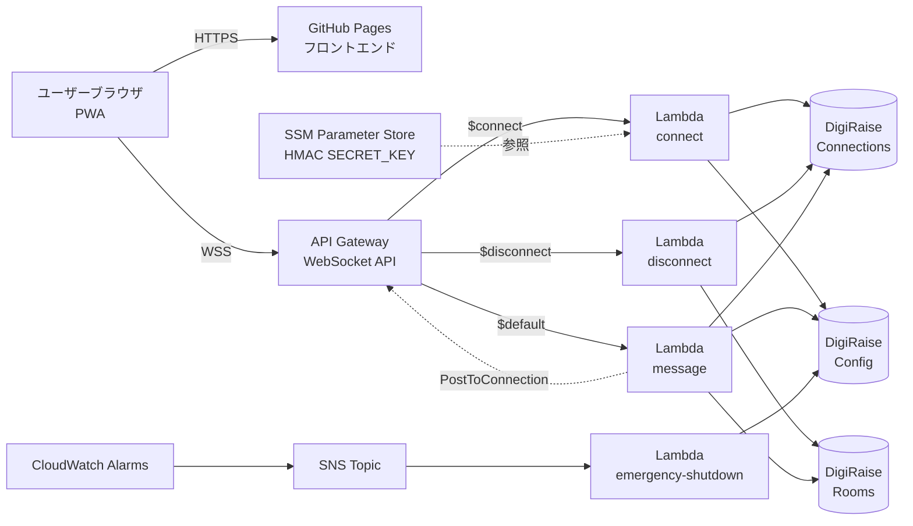
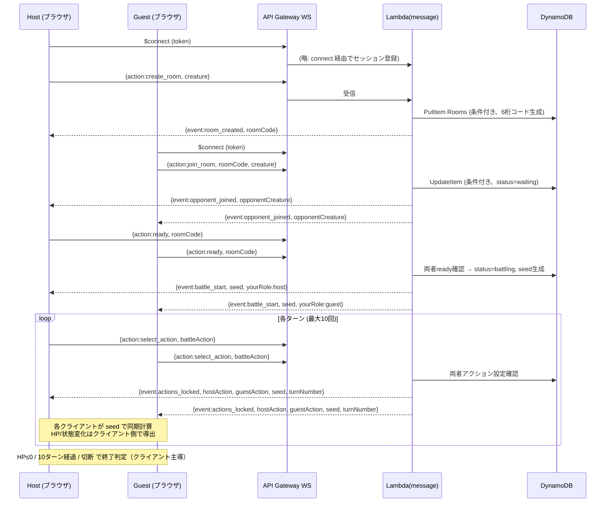
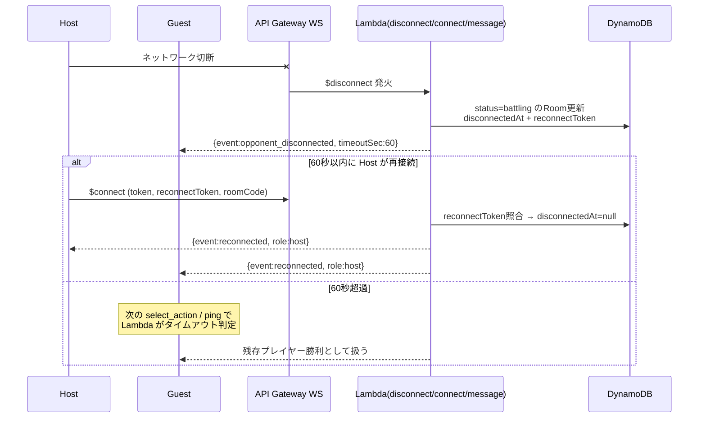
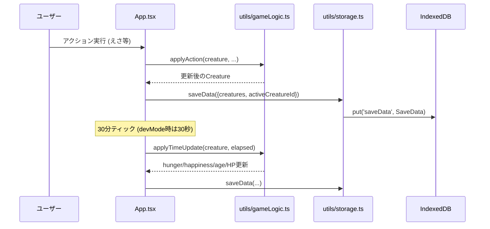
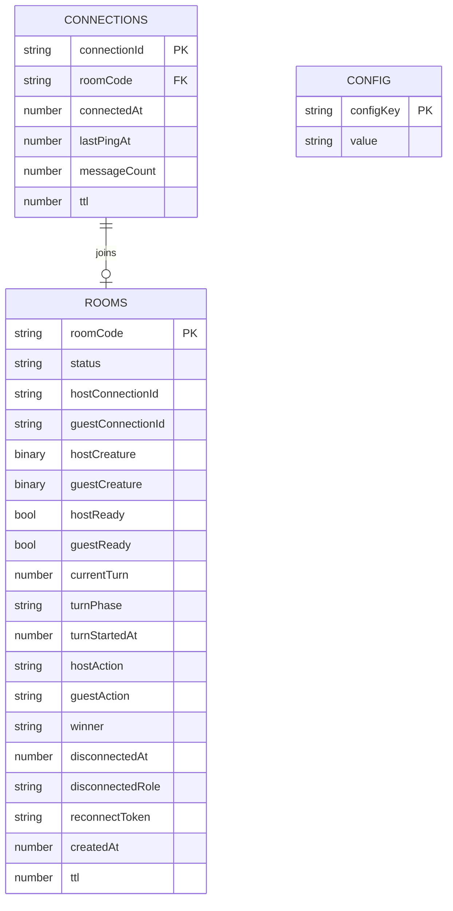
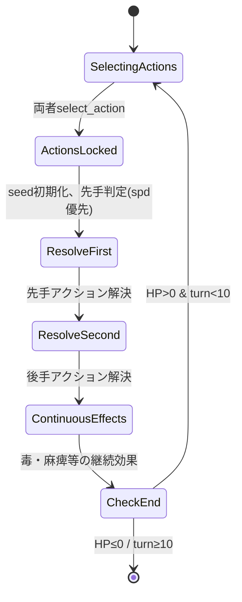

# 機能設計書

| 項目 | 内容 |
|------|------|
| 作成日 | 2026-05-03 |
| 最終更新 | 2026-05-03 |
| 担当 | バルベルデ（architecture-designer） |

---

## システム構成図

### 全体像（Mermaid）



### 補助経路（テキスト版）

```
+--------+   HTTPS    +--------------+
| Browser| =========> | GitHub Pages |   ← フロントエンド配信
+--------+            +--------------+
     |
     |   WSS
     v
+----------------------+
| API Gateway WS       |
+----------------------+
     |
     +---> Lambda(connect)              ─→ DigiRaiseConnections / Config
     +---> Lambda(disconnect)           ─→ DigiRaiseConnections / Rooms
     +---> Lambda(message)              ─→ DigiRaiseConnections / Rooms / Config
     +---> Lambda(emergency-shutdown)   ─→ DigiRaiseConfig（SNSトリガー）
```

---

## データフロー

### 1. バトルマッチング → ターン進行



### 2. 切断・再接続フロー



### 3. 育成データの保存（フロントエンド完結）



**動作の核**:

- バトルロジックは **フロントエンド完結**。サーバーは乱数シード配信・ターン管理・マッチングのみを担当する
- creature データはサーバー側で `json.RawMessage`（DynamoDB Binary 型）として透過保持し、サーバーは中身を解釈しない
- 非アクティブクリーチャーは時間停止（切替時に `lastUpdated` を現在時刻にリセット）
- 計測: 通常運用月額コスト $0.25 想定（小規模個人ゲーム前提）

---

## コンポーネント設計

### フロントエンド層

| コンポーネント | ファイル | 責務 |
|-------------|---------|------|
| `App` | `frontend/src/App.tsx` | ルート、画面ルーティング、`useState` 群による中央状態管理 |
| `TitleScreen` | `frontend/src/components/TitleScreen.tsx` | タイトル・セーブロード |
| `CreatureSetup` | `frontend/src/components/CreatureSetup.tsx` | 新規クリーチャーの名前・タイプ選択 |
| `MainGame` | `frontend/src/components/MainGame.tsx` | メイン画面（ステータスバー・アクション・⚔️ バトルボタン） |
| `StatusScreen` | `frontend/src/components/StatusScreen.tsx` | ステータス詳細・複数クリーチャー一覧・切替・個別削除 |
| `EvolutionScreen` | `frontend/src/components/EvolutionScreen.tsx` | 進化演出 |
| `CreatureDrawingScreen` | `frontend/src/components/CreatureDrawingScreen.tsx` | 進化後の 64×64 お絵描き |
| `DeathScreen` | `frontend/src/components/DeathScreen.tsx` | 死亡画面 |
| `BattleLobbyScreen` | `frontend/src/components/BattleLobbyScreen.tsx` | ルーム作成・参加・CPU 戦タブ |
| `BattleScreen` | `frontend/src/components/BattleScreen.tsx` | バトルメイン画面（左:自分 / 右:相手） |
| `BattleActionButtons` | `frontend/src/components/BattleActionButtons.tsx` | attack / guard / special ボタン |
| `BattleResult` | `frontend/src/components/BattleResult.tsx` | 勝敗結果モーダル |
| `TrainingMiniGame` | `frontend/src/components/TrainingMiniGame.tsx` | もぐらたたきミニゲーム |
| `PlayMiniGame` | `frontend/src/components/PlayMiniGame.tsx` | 神経衰弱ミニゲーム |
| `FeedMiniGame` | `frontend/src/components/FeedMiniGame.tsx` | ごはんポップアップ演出 |

#### フック・ユーティリティ

| 名前 | ファイル | 責務 |
|------|---------|------|
| `useBattleWebSocket` | `frontend/src/hooks/useBattleWebSocket.ts` | WebSocket 接続管理・自動 ping（30s）・自動再接続（指数バックオフ） |
| `useBattleState` | `frontend/src/hooks/useBattleState.ts` | `useReducer` によるバトル状態管理 |
| `battleLogic` | `frontend/src/utils/battleLogic.ts` | ダメージ計算・タイプ相性・LCG 乱数生成器・ターン解決 |
| `cpuBattle` | `frontend/src/utils/cpuBattle.ts` | CPU クリーチャー生成・アクション選択 |
| `evolution` | `frontend/src/utils/evolution.ts` | 進化条件判定 |
| `gameLogic` | `frontend/src/utils/gameLogic.ts` | えさ・トレーニング・あそぶ・睡眠・時間更新 |
| `storage` | `frontend/src/utils/storage.ts` | IndexedDB CRUD・JSON エクスポート/インポート（File System Access API 対応） |
| `wsToken` | `frontend/src/utils/wsToken.ts` | HMAC-SHA256 接続トークン生成（Web Crypto API） |
| `floodFill` | `frontend/src/utils/floodFill.ts` | お絵描き塗りつぶしアルゴリズム |

### バックエンド層

| コンポーネント | ファイル | 責務 |
|-------------|---------|------|
| `connect` Lambda | `backend/cmd/connect/main.go` + `backend/internal/handler/connect.go` | $connect ルート。HMAC 認証、メンテナンスモード判定、再接続トークン照合、Connections レコード作成 |
| `disconnect` Lambda | `backend/cmd/disconnect/main.go` + `backend/internal/handler/disconnect.go` | $disconnect ルート。バトル中なら 60 秒猶予 + reconnectToken 発行、待機中ならルーム削除 |
| `message` Lambda | `backend/cmd/message/main.go` + `backend/internal/handler/message.go` | $default ルート。action 別ルーティング、レート制限、ターン進行、PostToConnection 配信 |
| `emergency-shutdown` Lambda | `backend/cmd/emergency-shutdown/main.go` | SNS トリガー。`maintenance_mode` を `true` に書き込み、以降の $connect を 503 で全拒否 |
| `battle.Room` | `backend/internal/battle/room.go` | ルーム作成・参加・退出・アクション設定・バトル開始・ターン進行のドメインロジック |
| `db.Connections` | `backend/internal/db/connections.go` | `DigiRaiseConnections` テーブル CRUD（アトミック増分含む） |
| `db.Rooms` | `backend/internal/db/rooms.go` | `DigiRaiseRooms` テーブル CRUD（条件付き UpdateItem 多用） |
| `db.Config` | `backend/internal/db/config.go` | `DigiRaiseConfig` テーブル CRUD（メンテナンスフラグ） |
| `apigw.Client` | `backend/internal/apigw/client.go` | API Gateway Management API の `PostToConnection` ラッパー（GoneException を正常系として無視） |
| `auth.Token` | `backend/internal/auth/token.go` | HMAC-SHA256 トークン検証（タイムスタンプ ±60 秒、`hmac.Equal` で定数時間比較） |

### データ層

| エンティティ | テーブル / ストア | 責務 |
|-------------|----------------|------|
| 接続セッション | `DigiRaiseConnections`（DynamoDB） | 接続 ID 単位のセッション管理、レート制限カウンタ、TTL 1 時間 |
| ルーム・バトル状態 | `DigiRaiseRooms`（DynamoDB） | ルームコード単位の状態管理、TTL 2 時間 |
| 設定値 | `DigiRaiseConfig`（DynamoDB） | `maintenance_mode` 等のフラグ管理 |
| セーブデータ | IndexedDB `digi-raise/gameState` | `SaveData = { creatures, activeCreatureId }` を固定キー `"saveData"` で保存 |
| HMAC 鍵 | SSM Parameter Store `/digi-raise/hmac-secret-key` | `$connect` トークン検証用シークレット |

---

## 通信プロトコル設計

### WebSocket エンドポイント

```
wss://<API_ID>.execute-api.<REGION>.amazonaws.com/prod
```

実際の URL は `sam deploy` の Outputs で取得し、`frontend/.env` の `VITE_WS_ENDPOINT` に設定する。本ドキュメントには実 URL を記載しない。

### クライアント → サーバー（action）

| action | ペイロード | 用途 | 認証 |
|--------|-----------|------|------|
| `create_room` | `{ creature: <RawMessage> }` | 6桁ルームコード生成 | $connect 時 HMAC |
| `join_room` | `{ roomCode, creature }` | ルーム参加 | 同上 |
| `ready` | `{ roomCode }` | バトル開始準備完了 | 同上 |
| `select_action` | `{ roomCode, battleAction: "attack" \| "guard" \| "special" }` | ターン中のアクション選択 | 同上 |
| `ping` | `{}` | 接続維持・レート制限カウンタリセット | 同上 |
| `leave_room` | `{ roomCode }` | ルーム退出 | 同上 |

### サーバー → クライアント（event）

| event | 主要フィールド | 用途 |
|-------|-------------|------|
| `room_created` | `roomCode` | ルーム作成成功 |
| `opponent_joined` | `opponentCreature` | 相手参加通知（双方に送信） |
| `battle_start` | `seed`, `yourRole` | バトル開始（双方に送信） |
| `actions_locked` | `hostAction`, `guestAction`, `seed`, `turnNumber` | 両者アクション確定（双方に送信） |
| `opponent_disconnected` | `timeoutSec` | 相手切断通知（再接続猶予） |
| `reconnected` | `role` | 再接続成功通知（双方に送信） |
| `opponent_left` | — | 相手の明示的退出通知 |
| `room_left` | — | 自身の退出確認 |
| `error` | `code`, `message` | エラー通知 |
| `pong` | — | ping 応答 |

### エラーコード

| コード | 説明 |
|--------|------|
| `INVALID_MESSAGE` | JSON パースエラー |
| `INVALID_ACTION` | 不明な action |
| `INVALID_ROOM_CODE` | ルームコードのフォーマット不正 |
| `INVALID_ROOM_STATUS` | ルームの status が操作に適さない |
| `ROOM_NOT_FOUND` | ルーム不在 |
| `ROOM_FULL` | ルームが満員 / 参加不可 |
| `NOT_IN_ROOM` | ルーム未参加 |
| `CREATE_ROOM_FAILED` | ルーム作成失敗（重複リトライ上限） |
| `JOIN_ROOM_FAILED` | ルーム参加失敗 |
| `CANNOT_LEAVE` | 現在の status では退出不可 |
| `MISSING_ROOM_CODE` | roomCode 未指定 |
| `RATE_LIMITED` | レート制限超過 |
| `MAINTENANCE_MODE` | メンテナンス中（接続自体が `503` で拒否） |

### 上限・タイムアウト

| 項目 | 値 | 環境変数 / 設定 |
|------|----|--------------|
| クライアント→サーバー メッセージサイズ | 32 KB | API Gateway 制約（変更不可） |
| サーバー→クライアント メッセージサイズ | 128 KB | API Gateway 制約（変更不可） |
| 接続あたりレート制限 | 60 messages / 60 sec | コード定数 |
| アクション選択タイムアウト | 30 秒（超過で `guard` 強制） | コード定数 |
| 切断猶予 | 60 秒 | コード定数 |
| HMAC タイムスタンプ許容差 | ±60 秒 | コード定数 |
| Connections TTL | 3600 秒 | テーブル属性 `ttl` |
| Rooms TTL | 7200 秒 | テーブル属性 `ttl` |
| API Gateway スロットリング（$connect） | 10 req/sec, burst 20 | SAM テンプレート |
| API Gateway スロットリング（$default） | 200 req/sec, burst 400 | SAM テンプレート |

---

## データモデル

### ER 図（DynamoDB エンティティ）



GSI: `Connections.roomCode-index`（PK: `roomCode`）でルーム単位の参加者検索を高速化。

### 主要テーブル定義

#### DigiRaiseConnections

| 属性 | 型 | 制約 | 説明 |
|-------|----|----|------|
| `connectionId` | S | PK | API Gateway 割当の接続 ID |
| `roomCode` | S | nullable | 参加中のルームコード |
| `connectedAt` | N | NOT NULL | 接続タイムスタンプ（Unix 秒） |
| `lastPingAt` | N | NOT NULL | 最終アクティブ |
| `messageCount` | N | NOT NULL | レート制限カウンタ |
| `ttl` | N | NOT NULL | `connectedAt + 3600` |

#### DigiRaiseRooms

| 属性 | 型 | 制約 | 説明 |
|-------|----|----|------|
| `roomCode` | S | PK | 6桁英数字（紛らわしい I/O/0/1 を除外） |
| `status` | S | NOT NULL | `waiting` / `ready` / `battling` / `finished` |
| `hostCreature` / `guestCreature` | B | nullable | クリーチャーデータ JSON（`json.RawMessage`） |
| `hostReady` / `guestReady` | BOOL | default false | ready 状態 |
| `currentTurn` | N | default 0 | 現在ターン |
| `turnStartedAt` | N | — | 30 秒タイムアウト判定基準 |
| `reconnectToken` | S | nullable | 切断時に `crypto/rand` で 16 バイト生成 |
| `ttl` | N | NOT NULL | `createdAt + 7200` |

#### DigiRaiseConfig

| 属性 | 型 | 制約 | 説明 |
|-------|----|----|------|
| `configKey` | S | PK | 設定キー名 |
| `value` | S | NOT NULL | 設定値（例: `maintenance_mode = "false"`） |

### フロントエンド主要型（`frontend/src/types/`）

```typescript
// creature.ts
type CreatureType = 'fire' | 'water' | 'plant' | 'thunder' | 'dark' | 'light'
type EvolutionStage = 0 | 1 | 2 | 3 | 4 | 5

interface Creature {
  id: string
  name: string
  type: CreatureType
  evolutionStage: EvolutionStage
  hp: number; maxHp: number
  hunger: number; happiness: number
  level: number; exp: number
  atk: number; def: number; spd: number
  weight: number
  age: number              // float、30分ティックごとに +0.5
  isAlive: boolean         // false = 墓石
  isSleeping: boolean
  lastUpdated: number      // Unix ms
  wins?: number; losses?: number
  customSprites?: Partial<Record<EvolutionStage, string>>  // SVG文字列
}

interface SaveData {
  creatures: Creature[]
  activeCreatureId: string | null
}

// battle.ts
interface BattleState {
  phase: 'waiting' | 'ready' | 'selecting' | 'resolving' | 'finished'
  roomCode: string | null
  role: 'host' | 'guest' | null
  myCreature: CreatureSnapshot | null
  opponentCreature: CreatureSnapshot | null
  currentTurn: number
  myAction: BattleAction | null
  opponentAction: BattleAction | null
  specialCooldown: number
  myPoisonTurns: number; opponentPoisonTurns: number
  myParalyzed: boolean
  myDefBuff: number
  battleLog: string[]
  winner: 'me' | 'opponent' | 'draw' | null
  error: string | null
}
```

---

## バトルロジック詳細

### ダメージ計算式

```
baseDamage  = attacker.atk * 1.5 - defender.def * (guarding ? 1.6 : 0.8)
typeMod     = TYPE_ADVANTAGE[attacker.type][defender.type]   // 0.8 / 1.0 / 1.2
spdMod      = attacker.spd > defender.spd ? 1.1 : 0.9
finalDamage = max(1, floor(baseDamage * typeMod * spdMod))
```

### タイプ相性マトリクス

|         | Fire | Water | Plant | Thunder | Dark | Light |
|---------|------|-------|-------|---------|------|-------|
| Fire    | 1.0  | 0.8   | 1.2   | 1.0     | 1.0  | 1.0   |
| Water   | 1.2  | 1.0   | 0.8   | 1.0     | 1.0  | 1.0   |
| Plant   | 0.8  | 1.2   | 1.0   | 1.0     | 1.0  | 1.0   |
| Thunder | 1.0  | 1.2   | 1.0   | 1.0     | 0.8  | 1.2   |
| Dark    | 1.0  | 1.0   | 1.0   | 1.2     | 1.0  | 0.8   |
| Light   | 1.0  | 1.0   | 1.0   | 0.8     | 1.2  | 1.0   |

正本は `frontend/src/utils/battleLogic.ts` の `TYPE_ADVANTAGE`。本ドキュメントとコードに乖離があればコードを正とする。

### 特殊アクション（special、クールダウン2ターン）

| タイプ | 効果 |
|--------|------|
| Fire | 連続2回攻撃（各ダメージ ×0.7） |
| Water | 自己回復（maxHp × 0.2）+ 攻撃 |
| Plant | 毒付与（3ターン、毎ターン最大HP × 3% ダメージ） |
| Thunder | 麻痺（次ターン行動不可、50% 確率） |
| Dark | 相手の ATK を 1 ターン −30% |
| Light | 防御バフ（自 DEF × 1.5、2 ターン） |

### ターン解決順序



乱数消費順序を仕様で固定するため、`actions_locked` 受信時に `seed` で LCG を初期化し、ダメージ判定（特殊効果含む）の順序を厳密に保つ。

### 乱数同期（LCG）

```typescript
function createRng(seed: number): () => number {
  let state = seed
  return () => {
    state = (state * 1664525 + 1013904223) & 0xFFFFFFFF
    return state / 0xFFFFFFFF
  }
}
```

サーバーが `seed` を発行し、両クライアントが同一シードで同一順序の乱数を消費することで結果を一致させる。

### バトル終了条件

| 条件 | 判定主体 | 勝者 |
|------|---------|------|
| いずれかの HP ≤ 0 | クライアント（ターン解決後） | 相手プレイヤー |
| 10 ターン経過 | クライアント | HP が多い方（同値: 引き分け） |
| 相手が切断し 60 秒超過 | サーバー（次の `select_action` / `ping` 受信時に判定） | 残存プレイヤー |

### バトル後ステータス反映

| 結果 | 変化（アクティブクリーチャー） |
|------|--------------------------|
| 勝利 | wins +1, exp +(50 + 相手 level × 5), happiness +20 |
| 敗北 | losses +1, exp +10, happiness −10 |
| 引き分け | exp +25 |

HP はバトル終了時の値を維持する。

---

## 進化システム

### ステージと条件

| ステージ | 名称 | 進化条件 |
|---------|------|----------|
| 0 | タマゴ | — |
| 1 | ベイビー | タマゴをタップ（即時） |
| 2 | チャイルド | `age ≥ 1` |
| 3 | アダルト | `age ≥ 3` AND `happiness ≥ 50` |
| 4 | パーフェクト | `age ≥ 6` AND `level ≥ 8` AND `atk + def + spd ≥ 40` |
| 5 | アルティメット | `age ≥ 12` AND `level ≥ 14` AND 各ステータス `≥ 20` |

`age` は float（30分ティックごとに +0.5）。比較は float のまま行い、表示のみ `Math.floor`。

### 進化のたびのお絵描き

進化演出後に `drawing` 画面へ遷移し、ユーザーが 64×64 のピクセルアートを描画して SVG として `Creature.customSprites[stage]` に保存する。スキップ可能（スキップ時はデフォルトスプライト表示）。

---

## 状態遷移（フロントエンド画面）


---

## 非機能要件への対応

| 要件カテゴリ | 設計上の対応 |
|------------|-------------|
| パフォーマンス | フロントエンド完結のバトル計算で WS 往復を最小化（`actions_locked` 1 往復/ターン）。Service Worker による静的アセットキャッシュ |
| 信頼性 | DynamoDB 条件付き UpdateItem でアクション二重送信を防止、`PostToConnection` の `GoneException` は正常系として無視 |
| セキュリティ | $connect HMAC + メンテナンスモード、レート制限、TTL 自動削除、`hmac.Equal` 定数時間比較、`reconnectToken` を `crypto/rand` で生成 |
| 可観測性 | CloudWatch Logs（Lambda 4 種別）、CloudWatch Alarm（接続スパイク・Lambda スパイク）、SNS 通知 |
| 拡張性 | サーバーは creature を `json.RawMessage` で透過保持し、フロントエンドのスキーマ変更だけで進化系統追加が可能 |
