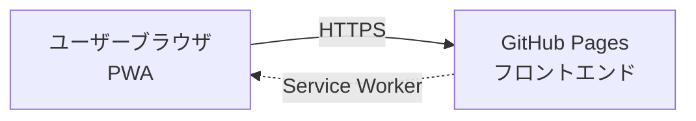
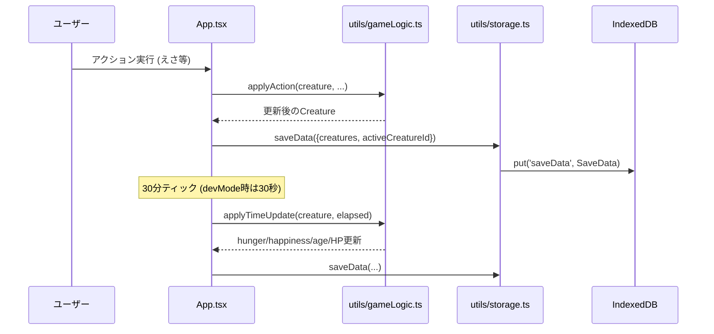
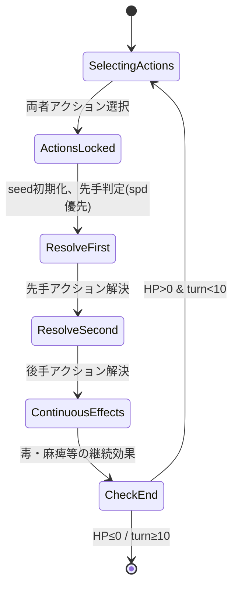
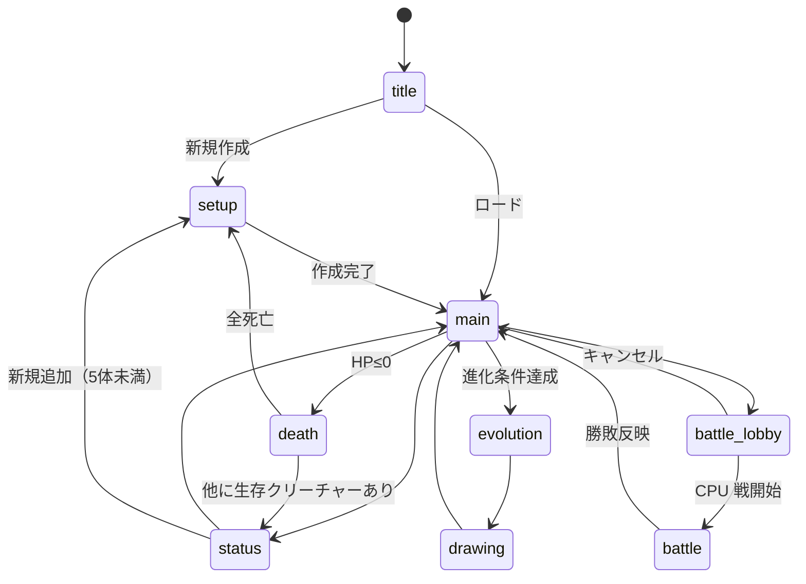

# 機能設計書

| 項目 | 内容 |
|------|------|
| 作成日 | 2026-05-03 |
| 最終更新 | 2026-06-20 |
| 担当 | バルベルデ（architecture-designer） |

---

## システム構成図



- すべてのゲームロジック（育成・バトル計算）はフロントエンド完結

---

## データフロー

### 育成データの保存（フロントエンド完結）



**動作の核**:

- すべてのゲームロジックは **フロントエンド完結**
- 非アクティブクリーチャーは時間停止（切替時に `lastUpdated` を現在時刻にリセット）

---

## コンポーネント設計

### フロントエンド層

| コンポーネント | ファイル | 責務 |
|-------------|---------|------|
| `App` | `src/App.tsx` | ルート、画面ルーティング、`useState` 群による中央状態管理 |
| `TitleScreen` | `src/components/TitleScreen.tsx` | タイトル・セーブロード |
| `CreatureSetup` | `src/components/CreatureSetup.tsx` | 新規クリーチャーの名前・タイプ選択 |
| `MainGame` | `src/components/MainGame.tsx` | メイン画面（ステータスバー・アクション・バトルボタン） |
| `StatusScreen` | `src/components/StatusScreen.tsx` | ステータス詳細・複数クリーチャー一覧・切替・個別削除 |
| `EvolutionScreen` | `src/components/EvolutionScreen.tsx` | 進化演出 |
| `CreatureDrawingScreen` | `src/components/CreatureDrawingScreen.tsx` | 進化後の 64×64 お絵描き |
| `DeathScreen` | `src/components/DeathScreen.tsx` | 死亡画面 |
| `BattleLobbyScreen` | `src/components/BattleLobbyScreen.tsx` | CPU 戦タブ |
| `BattleScreen` | `src/components/BattleScreen.tsx` | バトルメイン画面（左:自分 / 右:相手） |
| `BattleActionButtons` | `src/components/BattleActionButtons.tsx` | attack / guard / special ボタン |
| `BattleResult` | `src/components/BattleResult.tsx` | 勝敗結果モーダル |
| `TrainingMiniGame` | `src/components/TrainingMiniGame.tsx` | もぐらたたきミニゲーム |
| `PlayMiniGame` | `src/components/PlayMiniGame.tsx` | 神経衰弱ミニゲーム |
| `FeedMiniGame` | `src/components/FeedMiniGame.tsx` | ごはんポップアップ演出 |

#### フック・ユーティリティ

| 名前 | ファイル | 責務 |
|------|---------|------|
| `useBattleState` | `src/hooks/useBattleState.ts` | `useReducer` によるバトル状態管理 |
| `battleLogic` | `src/utils/battleLogic.ts` | ダメージ計算・タイプ相性・LCG 乱数生成器・ターン解決 |
| `cpuBattle` | `src/utils/cpuBattle.ts` | CPU クリーチャー生成・アクション選択 |
| `evolution` | `src/utils/evolution.ts` | 進化条件判定 |
| `gameLogic` | `src/utils/gameLogic.ts` | えさ・トレーニング・あそぶ・睡眠・時間更新 |
| `storage` | `src/utils/storage.ts` | IndexedDB CRUD・JSON エクスポート/インポート（File System Access API 対応） |
| `floodFill` | `src/utils/floodFill.ts` | お絵描き塗りつぶしアルゴリズム |

### データ層

| エンティティ | ストア | 責務 |
|-------------|--------|------|
| セーブデータ | IndexedDB `digi-raise/gameState` | `SaveData = { creatures, activeCreatureId }` を固定キー `"saveData"` で保存 |

---

## データモデル

### フロントエンド主要型（`src/types/`）

```typescript
// creature.ts
type CreatureId =
  | 'egg' | 'baby'
  | 'childA' | 'childB' | 'childC'
  | 'adultA1' | 'adultA2' | 'adultB1' | 'adultB2' | 'adultC1' | 'adultC2'
  | 'perfectA1' | 'perfectA2' | 'perfectB1' | 'perfectB2' | 'perfectC1' | 'perfectC2'
  | 'ultimateA' | 'ultimateB' | 'ultimateC'

type EvolutionStage = 0 | 1 | 2 | 3 | 4 | 5
type CreatureBranch = 'A' | 'B' | 'C' | 'none'

// 進化ツリー定義（src/data/evolutions.ts の CREATURE_TREE）
interface CreatureDefinition {
  id: CreatureId
  name: string             // 表示名（例: 'プチボール', 'セイラフィン'）
  stage: EvolutionStage
  evolvesTo: CreatureId[]  // [] = 終点クリーチャー
}

interface Creature {
  id: string
  name: string
  creatureId: CreatureId   // 進化ツリー上の ID（旧 type フィールド）
  evolutionStage: EvolutionStage
  hp: number; maxHp: number
  hunger: number; happiness: number
  level: number; exp: number
  atk: number; def: number; spd: number
  weight: number
  age: number              // float、30分ティックごとに +0.5
  isAlive: boolean         // false = 墓石
  isSleeping: boolean
  lastUpdated: number      // Unix ms
  evolutionName: string    // 現在の進化形態の表示名
  wins?: number; losses?: number
  customSprites?: Partial<Record<EvolutionStage, string>>  // SVG文字列
}

interface SaveData {
  creatures: Creature[]
  activeCreatureId: string | null
}

// battle.ts
interface BattleState {
  phase: 'waiting' | 'ready' | 'selecting' | 'resolving' | 'finished'
  myCreature: CreatureSnapshot | null
  opponentCreature: CreatureSnapshot | null
  currentTurn: number
  myAction: BattleAction | null
  opponentAction: BattleAction | null
  specialCooldown: number
  myPoisonTurns: number; opponentPoisonTurns: number
  myParalyzed: boolean
  myDefBuff: number
  battleLog: string[]
  winner: 'me' | 'opponent' | 'draw' | null
  error: string | null
}
```

---

## 進化ツリー

### ブランチ（分岐系統）

| ブランチ | テーマ | カラー |
|---------|--------|--------|
| A（善） | 神聖・光 | #ffd700（ゴールド） |
| B（悪） | 禍々しい・闇 | #9b59b6（パープル） |
| C（中間） | カッコいい・クール | #3498db（ブルー） |
| none | 未分岐（卵・ベイビー） | #9ca3af（グレー） |

### 進化分岐ロジック

```
egg → baby（タップで即時進化）

baby → child（age ≥ 1 で分岐）
  happiness ≥ 70 → childA（善）
  happiness ≤ 30 → childB（悪）
  happiness 31〜69 → childC（中間）

child → adult（age ≥ 3 AND happiness ≥ 50 で分岐）
  happiness ≥ 70 → adultX1（高道）
  happiness < 70  → adultX2（低道）

adult → perfect（age ≥ 6 AND level ≥ 8 AND atk+def+spd ≥ 40）
  → perfectX1（adultX1 から）または perfectX2（adultX2 から）

perfectX1 → ultimate（age ≥ 12 AND level ≥ 14 AND 各 stat ≥ 20）
  → ultimateA / B / C

perfectX2 → 終点（evolvesTo: []）アルティメットには進化しない
```

### 20体一覧

| CreatureId | 名前 | ステージ | 終点 |
|-----------|------|---------|------|
| egg | タマゴ | 0 | — |
| baby | プチボール | 1 | — |
| childA | セイラント | 2 | — |
| childB | ダーコン | 2 | — |
| childC | グレイン | 2 | — |
| adultA1 | セイラフィン | 3 | — |
| adultA2 | ルーメナ | 3 | — |
| adultB1 | ヴォルカン | 3 | — |
| adultB2 | グラウム | 3 | — |
| adultC1 | ゼファリス | 3 | — |
| adultC2 | ブレイズ | 3 | — |
| perfectA1 | セラフィデス | 4 | — |
| perfectA2 | ルーメニア | 4 | **終点** |
| perfectB1 | ヴォルカニス | 4 | — |
| perfectB2 | グラウマル | 4 | **終点** |
| perfectC1 | ゼファリオン | 4 | — |
| perfectC2 | ブレイゾン | 4 | **終点** |
| ultimateA | セラフォム | 5 | 終点 |
| ultimateB | ヴォルカルム | 5 | 終点 |
| ultimateC | ゼファリウス | 5 | 終点 |

---

## バトルロジック詳細

### ダメージ計算式

```
baseDamage  = attacker.atk * 1.5 - defender.def * (guarding ? 1.6 : 0.8)
typeMod     = TYPE_ADVANTAGE[attacker.type][defender.type]   // 0.8 / 1.0 / 1.2
spdMod      = attacker.spd > defender.spd ? 1.1 : 0.9
finalDamage = max(1, floor(baseDamage * typeMod * spdMod))
```

### タイプ相性マトリクス

|         | Fire | Water | Plant | Thunder | Dark | Light |
|---------|------|-------|-------|---------|------|-------|
| Fire    | 1.0  | 0.8   | 1.2   | 1.0     | 1.0  | 1.0   |
| Water   | 1.2  | 1.0   | 0.8   | 1.0     | 1.0  | 1.0   |
| Plant   | 0.8  | 1.2   | 1.0   | 1.0     | 1.0  | 1.0   |
| Thunder | 1.0  | 1.2   | 1.0   | 1.0     | 0.8  | 1.2   |
| Dark    | 1.0  | 1.0   | 1.0   | 1.2     | 1.0  | 0.8   |
| Light   | 1.0  | 1.0   | 1.0   | 0.8     | 1.2  | 1.0   |

正本は `src/utils/battleLogic.ts` の `TYPE_ADVANTAGE`。本ドキュメントとコードに乖離があればコードを正とする。

### 特殊アクション（special、クールダウン2ターン）

| タイプ | 効果 |
|--------|------|
| Fire | 連続2回攻撃（各ダメージ ×0.7） |
| Water | 自己回復（maxHp × 0.2）+ 攻撃 |
| Plant | 毒付与（3ターン、毎ターン最大HP × 3% ダメージ） |
| Thunder | 麻痺（次ターン行動不可、50% 確率） |
| Dark | 相手の ATK を 1 ターン −30% |
| Light | 防御バフ（自 DEF × 1.5、2 ターン） |

### ターン解決順序



### バトル終了条件

| 条件 | 判定主体 | 勝者 |
|------|---------|------|
| いずれかの HP ≤ 0 | クライアント（ターン解決後） | 相手プレイヤー |
| 10 ターン経過 | クライアント | HP が多い方（同値: 引き分け） |

### バトル後ステータス反映

| 結果 | 変化（アクティブクリーチャー） |
|------|--------------------------|
| 勝利 | wins +1, exp +(50 + 相手 level × 5), happiness +20 |
| 敗北 | losses +1, exp +10, happiness −10 |
| 引き分け | exp +25 |

HP はバトル終了時の値を維持する。

---

## 進化システム

### ステージと条件

| ステージ | 名称 | 進化条件 |
|---------|------|----------|
| 0 | タマゴ | — |
| 1 | ベイビー | minAge: 0 を満たした時点で自動ふ化（タップ不要） |
| 2 | チャイルド | `age ≥ 1` |
| 3 | アダルト | `age ≥ 3` AND `happiness ≥ 50` |
| 4 | パーフェクト | `age ≥ 6` AND `level ≥ 8` AND `atk + def + spd ≥ 40` |
| 5 | アルティメット | `age ≥ 12` AND `level ≥ 14` AND 各ステータス `≥ 20` |

`age` は float（30分ティックごとに +0.5）。比較は float のまま行い、表示のみ `Math.floor`。

### 進化のたびのお絵描き

進化演出後に `drawing` 画面へ遷移し、ユーザーが 64×64 のピクセルアートを描画して SVG として `Creature.customSprites[stage]` に保存する。スキップ可能（スキップ時はデフォルトスプライト表示）。

---

## 状態遷移（フロントエンド画面）



---

## 非機能要件への対応

| 要件カテゴリ | 設計上の対応 |
|------------|-------------|
| パフォーマンス | フロントエンド完結のバトル計算。Service Worker による静的アセットキャッシュ |
| セキュリティ | カスタム SVG をエクスポート対象から除外（XSS 対策）。`dangerouslySetInnerHTML` は現時点未使用（`customSvg` は `ReactNode` として JSX 描画）。将来使用時は DOMPurify 必須 |
| 拡張性 | 新タイプ・新進化系統は `src/data/evolutions.ts` の追加のみで対応可能 |
